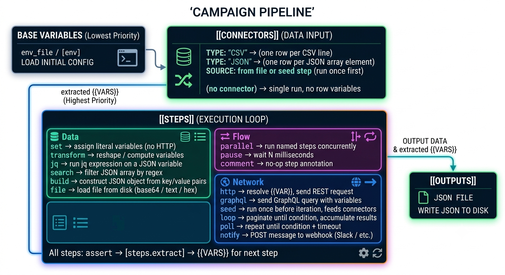

# Terapi — Usage Guide

## Table of contents

- [Installation](#installation)
- [TUI mode](#tui-mode)
  - [Panels](#panels)
  - [Request panel](#request-panel)
  - [Collections panel](#collections-panel)
  - [History panel](#history-panel)
  - [Campaigns panel](#campaigns-panel)
  - [GraphQL mode](#graphql-mode)
  - [Keybindings](#keybindings)
- [Collections](#collections)
  - [Directory resolution](#directory-resolution)
  - [Collection TOML format](#collection-toml-format)
- [Demo mode](#demo-mode)
- [Import](#import)
  - [Import TOML (collection / campaign)](#import-toml-collection--campaign)
  - [Import Postman v2.1](#import-postman-v21)
  - [Import Insomnia v4](#import-insomnia-v4)
- [OAuth2 authentication](#oauth2-authentication)
- [Campaign runner](#campaign-runner)
  - [Campaign TOML format](#campaign-toml-format)
  - [Campaign pipeline overview](#campaign-pipeline-overview)
  - [Campaign parameters](#campaign-parameters)
  - [Variable substitution](#variable-substitution)
  - [Variable extraction](#variable-extraction)
  - [Conditional execution (`when`)](#conditional-execution-when)
  - [Assertions](#assertions)
  - [Continue on error](#continue-on-error)
  - [Pause steps](#pause-steps)
  - [Transform steps](#transform-steps)
  - [File Loader steps](#file-loader-steps)
  - [Search / Filter steps](#search--filter-steps)
  - [Poll steps](#poll-steps)
  - [Set steps](#set-steps)
  - [JQ steps](#jq-steps)
  - [Parallel steps](#parallel-steps)
  - [Notify steps](#notify-steps)
  - [Build JSON steps](#build-json-step)
  - [Loop steps (pagination)](#loop-steps-pagination)
  - [Multipart form-data](#multipart-form-data)
  - [Input connectors](#input-connectors)
    - [CSV connector](#csv-connector)
    - [JSON connector — from file](#json-connector--from-file)
    - [JSON connector — from seed step](#json-connector--from-seed-step)
  - [Output connectors](#output-connectors)
  - [Campaign examples](#campaign-examples)
  - [Silent mode (CI/cron)](#silent-mode-cicron)
  - [Step filter (--only)](#step-filter---only)
  - [Output formats (--format)](#output-formats---format)
  - [Retry logic (--retry)](#retry-logic---retry)
- [Campaign builder](#campaign-builder)
  - [Invocation](#invocation)
  - [Layout](#layout)
  - [Pipeline view](#pipeline-view-1)
  - [Catalog — brick types](#catalog--brick-types)
  - [Step editor](#step-editor)
  - [Running a step](#running-a-step)
  - [JSON path autocomplete in Extract fields](#json-path-autocomplete-in-extract-fields)
  - [Connectors \[IN\]](#connectors-in)
  - [Outputs \[OUT\]](#outputs-out)
  - [Variables panel](#variables-panel)
  - [Checker](#checker)
  - [TOML preview](#toml-preview)
  - [Quit confirmation](#quit-confirmation)
  - [Builder keybindings](#builder-keybindings)

---

## Installation

```bash
cargo install terapi
```

Or build from source:

```bash
git clone https://github.com/tsodev/terapi
cd terapi
cargo build --release
./target/release/terapi
```

**Requirements:** Rust 1.75+, any modern terminal with 256-color support.

### Environment setup

`terapi-env.sh` (included in the repository) configures all terapi environment variables with sensible defaults and launches terapi:

```bash
./terapi-env.sh                        # TUI
./terapi-env.sh run campaign.toml      # headless runner
./terapi-env.sh build                  # campaign builder

# Or source it to export vars into the current shell without launching:
source ./terapi-env.sh
terapi run campaign.toml --format json
```

| Variable | Default (auto-detected) | Purpose |
|----------|------------------------|---------|
| `TERAPI_DIR` | `~/.config/terapi/` | Data directory (collections, envs, campaigns) |
| `TERAPI_JSON_EDITOR` | `jsoned` (if in PATH) | External editor/viewer for body JSON and response (`E` key) |
| `TERAPI_DIFF` | `difft` or `delta` (if in PATH) | External diff tool for response comparison (`d` key) |
| `EDITOR` / `VISUAL` | `vi` | Fallback text editor for TOML files (`E` key in Collections/Campaigns) |

Override any variable before calling the script:

```bash
TERAPI_DIR=~/myproject/.terapi ./terapi-env.sh
TERAPI_JSON_EDITOR=nvim ./terapi-env.sh
```

---

## TUI mode

Launch the TUI with no arguments:

```bash
terapi
```

### Panels

The interface is divided into three top-level panels, navigated with `Tab`:

| Panel | Description |
|-------|-------------|
| **Collections** | Browse saved collections and requests — default landing tab |
| **Request** | Build and send HTTP requests, view responses |
| **Env** | Create and manage environment variables across multiple environments |
| **History** | Persistent log of all sent requests and their responses |
| **Campaigns** | List, inspect, and run campaign TOML files with live step-by-step progress |

### Request panel

The Request panel is split into four zones, from top to bottom:

```
┌─ URL ─────────────────────────────────────────────────────────────┐
│   GET  https://api.example.com/users                              │
└───────────────────────────────────────────────────────────────────┘
```

In URL edit mode (`e`), the bar highlights and shows a cursor:

```
┌─ URL ─────────────────────────────────────────────────────────────┐
│ ◀ GET ▶  https://api.example.com/users_                           │
└───────────────────────────────────────────────────────────────────┘
```

**Workflow — building a request from scratch:**
1. Press `n` to clear all fields and start a new blank request
2. Press `e` to enter URL edit mode — type the URL, use `↑`/`↓` to set the method, `Enter` to send or `Esc` to cancel
3. Navigate sub-tabs (`←`/`→`) to add headers, URL params, and body
4. Press `s` to send at any time
5. Press `S` to save the current request to a collection (see below)

**Sending a request:**
1. Press `e` to enter URL edit mode
2. Type the URL (Backspace to delete)
3. Use `↑` / `↓` to change the HTTP method
4. Press `←` / `→` to exit URL mode and jump directly to a sub-tab (Headers, Body…)
5. Press `Enter` to send — or `Esc` to finish editing without sending
6. Alternatively, press `s` at any time to send the current URL without entering edit mode

`{{VAR}}` placeholders in the URL (and all other fields) are automatically resolved from the active environment before the request is sent.

#### Variable auto-completion (`{{`)

Typing `{{` in any editable field opens a picker overlay showing environment variables (white) and **built-in variables** (yellow) with a live preview:

```
┌─ Insert variable · filter: TO   ──────────┐
│  {{TOKEN}}  = eyJhbGciOiJIUzI...          │
│▶ {{TOKEN_EXP}}  = 3600                    │
│  {{TIMESTAMP}}  = 1751291525              │
│                                           │
│  ↑/↓: navigate  Enter: insert  Esc: cancel │
└──────────────────────────────────────────┘
```

- Works in: URL bar, header values, URL param values, body JSON field values, body text
- Continue typing after `{{` to filter the list in real time
- `Enter` inserts the selected variable as `{{VAR_NAME}}`
- `Esc` closes the picker and leaves `{{` as typed
- `Backspace` with an empty filter removes one `{` and closes the picker
- Built-in variables are always available, even without an active environment

#### Built-in variables

A set of predefined variables resolved at send time — no environment needed:

| Variable | Example | Description |
|---|---|---|
| `{{DATE}}` | `2026-06-30` | Today's date |
| `{{DATE+1}}` / `{{DATE-1}}` | `2026-07-01` | ±N days (`d` unit optional: `{{DATE+7d}}`) |
| `{{TIME}}` | `14:32:05` | Current time |
| `{{TIME+1}}` / `{{TIME-1}}` | `15:32:05` | ±N hours; use `m` for minutes: `{{TIME+30m}}` |
| `{{DATETIME}}` | `2026-06-30T14:32:05` | Date + time (arithmetic in days) |
| `{{TIMESTAMP}}` | `1751291525` | Unix timestamp (seconds) |
| `{{TIMESTAMP_MS}}` | `1751291525000` | Unix timestamp (milliseconds) |
| `{{UUID}}` | `550e8400-e29b-…` | UUID v4 — new value on every send |
| `{{RANDOM_INT}}` | `42317` | Random integer 0–99 999 |
| `{{RANDOM_STRING}}` | `k3mw9xzp` | 8-char random alphanumeric string |
| `{{APPNAME}}` | `terapi` | Application name |
| `{{VERSION}}` | `0.10.3` | Current terapi version |

Built-in variables are resolved after environment variables, so a user-defined `{{DATE}}` in the active env overrides the built-in.

All built-in variables work in campaigns too — in URLs, headers, body, `[env]` values, and `when`/`assert` values.

The response block title shows the **status code** (color-coded green/yellow/red) and **elapsed time** while the request is in flight, a `⟳ sending…` indicator is shown.

```
┌─ URL ──────────────────────────────────────────────┐
│ GET  https://api.example.com/users                  │
└─────────────────────────────────────────────────────┘
┌─ Description | Headers | URL Params | Body | Auth | Options ─┐
└──────────────────────────────────────────────────────────────┘
┌─ (Request content for the selected sub-tab) ────────┐
└─────────────────────────────────────────────────────┘
┌─ JSON · Raw  r: toggle  -/=: resize ────────────────┐
│  Key              Type     Value                     │
│  ▼ (root)         Object                             │
│    status         String   "success"                 │
│    code           Number   200                       │
│  ▼ data           Object                             │
│    ▶ user         Object   { id: 42, name: "…" }    │
└─────────────────────────────────────────────────────┘
```

**Sub-tabs** (navigate with `←` / `→`):

| Sub-tab | Purpose |
|---------|---------|
| Description | Free-text note about the request — `i` to edit, `Esc` to exit, persisted in collection TOML |
| Headers | Request headers — common header picker + custom entry |
| URL Params | Query string parameters |
| Body | Raw JSON body editor |
| Auth | Authentication — No Auth / Bearer / Basic / API Key / OAuth2 CC / OAuth2 AC |
| Options | TLS verification, timeout, redirects, cookie jar |

#### Auth sub-tab

Navigate to the Auth sub-tab with `←` / `→`. The sub-tab shows an interactive type selector and the fields for the selected type.

**Type selector** (always row 0):

```
 Type    No Auth    Bearer    Basic    API Key    OAuth2 CC    OAuth2 AC
```

The active type is highlighted in yellow. Press `Space` or `Enter` on this row to cycle through types.

**Bearer**

```
 Type    No Auth   ●Bearer●   Basic    API Key

 Token    eyJhbGciOiJIUzI1NiIsInR5cCI6IkpXVCJ9…
```

`Enter` on the Token row opens an edit modal. The token is injected as `Authorization: Bearer <token>` at send time.

**Basic**

```
 Type    No Auth    Bearer   ●Basic●   API Key

 Username  admin
 Password  ••••••••
```

Username and password are each editable in a modal. Password is always masked. At send time, `username:password` is Base64-encoded and sent as `Authorization: Basic …`.

**API Key**

```
 Type    No Auth    Bearer    Basic   ●API Key●

 Key Name   X-API-Key
 Key Value  sk-…
 Location   ●Header●   Query Param
```

`Enter` on Key Name / Key Value to edit. `Space` or `Enter` on the Location row toggles between **Header** (added as a request header) and **Query Param** (appended to the URL as `?<name>=<value>`).

**OAuth2 Client Credentials**

```
 Type    No Auth    Bearer    Basic    API Key   ●OAuth2 CC●   OAuth2 AC

 Token URL     http://auth.example.com/token
 Client ID     my-client
 Client Secret ••••••••
 Scope         api:read
```

Machine-to-machine flow — no browser needed. When `s` is pressed:
1. Terapi checks whether a valid token is in the session cache for this `(type, token_url, client_id)` triple.
2. If no valid token exists, a `POST application/x-www-form-urlencoded` is sent with `grant_type=client_credentials`. A banner `⟳ fetching token…` appears in the Auth panel.
3. Once the token is returned, it is cached (respecting `expires_in`) and the original request is sent automatically.

Press `f` from the Auth tab to fetch the token without sending the request.

**OAuth2 Authorization Code**

```
 Type    No Auth    Bearer    Basic    API Key    OAuth2 CC   ●OAuth2 AC●

 Token URL     http://auth.example.com/token
 Client ID     my-client
 Client Secret ••••••••
 Scope         openid profile
 Auth URL      http://auth.example.com/authorize
 Redirect Port 9876
```

Browser-based flow. Pressing `f` (or `s` when no cached token exists):
1. Terapi builds the authorization URL and opens it in the system browser (`open` on macOS, `xdg-open` on Linux).
2. A local TCP listener is started on the **Redirect Port** (default 9876). The banner changes to `⟳ waiting for browser callback on port 9876…`.
3. The user completes login in the browser; the server redirects to `http://127.0.0.1:9876/?code=…`. Terapi captures the code (5-minute timeout).
4. The code is exchanged for a token via `POST` to **Token URL**. The token is cached and the request fires.

Press `Esc` at any point to cancel the browser wait.

**Token caching**

- Cache key: `auth_type:token_url:client_id` — editing any of these fields invalidates the cache.
- Tokens are kept in memory for the duration of the session. They are never written to disk.
- The Auth panel shows `● token cached` (green) or `○ no token  (f to fetch)` (grey).
- The **Token Secret** field value is always masked with `••••••••` in the UI.

In all modes, `{{VAR}}` placeholders in auth field values are resolved from the active environment at send time. Auth config (all fields except the token) is saved with the request when using `S` (Save to collection).

#### Saving a request (`S`)

Press `S` (Shift+s) from anywhere in the Request tab to save the current request state to a collection:

```
┌──────────────── Save Request ───────────────────┐
│                                                  │
│  Name:        Get Pikachu_                       │
│                                                  │
│  Collection:  ↑ Public REST APIs ↓  (1/2)       │
│                                                  │
│  Folder:      ↑ PokeAPI ↓          (3/6)        │
│                                                  │
│  Tab: next field  ↑/↓: navigate  n: new  Enter: save  │
└──────────────────────────────────────────────────┘
```

- **Name** — free text, required
- **Collection** — `↑`/`↓` to cycle through existing collections; `n` to create a new collection inline (`+ _` prompt, `Enter` to confirm, `Esc` to cancel)
- **Folder** — `↑`/`↓` to cycle through folders in the selected collection plus `(root)`; `n` to create a new folder inline
- `Tab` always cycles Name → Collection → Folder → Name
- `Enter` saves and writes to disk immediately; the request appears in the Collections tab
- `Esc` cancels without saving
- When a request was loaded from Collections (`Enter` or `e`) or already saved in the session, the modal opens pre-filled with the existing name, collection, and folder

The saved request includes method, URL (with query params appended), headers, and body.

#### Options sub-tab

Navigate to the Options sub-tab with `←/→`. Use `↑`/`↓` to move between the four options, `Space` or `Enter` to toggle or cycle the selected one.

| Option | Default | Description |
|--------|---------|-------------|
| Skip TLS verification | off | Accept self-signed or hostname-mismatched certificates |
| Follow redirects | on | Automatically follow 3xx responses (up to 10 hops) |
| Timeout | 30 s | Request timeout — cycles through presets: 5 / 10 / 15 / 20 / 30 / 45 / 60 / 90 / 120 / 300 s |
| Cookie jar | off | Store received cookies and re-send them on subsequent requests (session mode) |

Active boolean options turn yellow. The timeout shows the current value in brackets (e.g. `[30s]`); each press of `Space`/`Enter` advances to the next preset, wrapping back to 5 s after 300 s.

```
┌─ Options ──────────────────────────────────────────────────────────┐
│                                                                      │
│▶ [ ] Skip TLS verification  (accept self-signed / mismatched certs) │
│                                                                      │
│  [x] Follow redirects        (automatically follow 3xx, up to 10)   │
│                                                                      │
│  [30s] Timeout               (Space/Enter cycles: 5→10→…→300 s)     │
│                                                                      │
│  [ ] Cookie jar              (store & send cookies across requests)  │
│                                                                      │
│  ↑/↓: navigate   Space/Enter: toggle / cycle timeout                │
└──────────────────────────────────────────────────────────────────────┘
```

**Cookie jar** — when enabled, terapi behaves like a browser for cookies: `Set-Cookie` headers received in responses are stored and automatically included in the `Cookie` header of subsequent requests. Useful for testing session-based authentication (login → session cookie → authenticated requests).

> **User-Agent** — terapi automatically sets `User-Agent: terapi/<version>` on every request. You can override it per-request by adding a `User-Agent` header in the Headers sub-tab.

The jar is cleared automatically when the option is toggled off or when starting a new request (`n`). All four options are persisted in the collection TOML and restored when loading a request from Collections.

#### URL Params editor

Switch to the URL Params sub-tab and use the same keys as the headers editor, with the addition of `Enter` to edit a selected param:

```
┌─ URL Params (2) ────────────────────────────────────────────────┐
│  page                         = 2                                │
│▶ limit                        = 10                               │
└──────────────────────────────────────────────────────────────────┘
```

#### Headers editor

Press `a` to add a header. A picker appears with the most common HTTP headers:

```
┌─ Add header ──────────────────────────────────────────┐
│  Authorization         Bearer ...                      │
│▶ Content-Type          application/json                │
│  Accept                application/json                │
│  Accept-Language       en-US,en;q=0.9                 │
│  Accept-Encoding       gzip, deflate, br               │
│  Cache-Control         no-cache                        │
│  X-API-Key                                             │
│  X-Request-ID                                          │
│  User-Agent                                            │
│  Origin                                                │
│  Referer                                               │
│  Custom…                                               │
│  ↑/↓: navigate  Enter: select  Esc: cancel            │
└───────────────────────────────────────────────────────┘
```

- Selecting a common header pre-fills the key and default value; the modal opens with the cursor on the **value** field, ready to edit
- **Content-Type** opens a second picker with 9 common values (`application/json`, `multipart/form-data`, `text/plain`…); `Esc` goes back to the header picker
- **Custom…** opens a blank modal with the cursor on the **key** field
- `{{` in the value field opens the variable picker (active env required)

| Key | Action |
|-----|--------|
| `a` | Add a param (Key + Value modal, `Tab` to switch fields) |
| `d` | Delete selected param |
| `Enter` | Edit selected param |
| `↑` / `↓` | Navigate params |

At send time params are recomposed as a query string and appended to the URL (`?key=value&key2=value2`). If the URL already contains a `?`, params are joined with `&`.

**Auto-parse on load** — when a request is loaded from Collections and its URL contains a query string (e.g. `https://api.example.com/users?page=2&limit=10`), terapi splits it automatically: the URL bar receives the base URL (`https://api.example.com/users`) and the params list is populated with the parsed key/value pairs.

#### Body editor

The body editor has two modes, toggled with `t` (when the Body sub-tab is active and outside edit mode).

**Text mode** (default)

```
┌─ Body  [Text]  (4 lines)  i: edit  t: JSON mode ───────────────┐
│ {                                                                 │
│   "email": "admin@example.com",                                  │
│   "password": "{{PASSWORD}}"                                     │
│ }                                                                 │
└──────────────────────────────────────────────────────────────────┘
```

Press `i` to enter edit mode (border turns green). Full multi-line editing: arrows, Home/End, Backspace/Delete. Press `Esc` to exit.

Press `E` (outside edit mode) to open the body in the external JSON editor configured via `$TERAPI_JSON_EDITOR` (defaults to `jsoned`). The TUI suspends, the editor opens `/tmp/terapi_body.json`, and the content is reloaded when the editor exits. See [External JSON editor](#external-json-editor).

**JSON mode** (structured key/value)

```
┌─ Body  [JSON]  (2 fields)  i: edit  t: text mode ──────────────┐
│  Key                Value                                         │
│  email              "admin@example.com"                          │
│▶ password           "{{PASSWORD}}"                               │
└──────────────────────────────────────────────────────────────────┘
```

Press `i` to enter the field editor (border turns green), then:

| Key | Action |
|-----|--------|
| `a` | Add a new field (Key + Value modal) |
| `d` | Delete the selected field |
| `Enter` / `e` | Edit the selected field |
| `↑` / `↓` | Navigate fields |
| `Esc` | Exit field editor |

Values are **auto-typed** when the request is sent:

| Value | Serialized as |
|-------|---------------|
| `42`, `-3`, `1.5` | JSON number |
| `true` / `false` | JSON boolean |
| `null` | JSON null |
| anything else | JSON string (with quotes) |

**Switching modes** — pressing `t` converts content between modes:
- **Text → JSON**: the textarea is parsed as a JSON object; if valid, fields are extracted into the table
- **JSON → Text**: fields are serialized back to pretty-printed JSON in the textarea

An empty body (no text / no fields) sends no request body.

#### GraphQL mode

Press `g` on the Request tab to switch to **GraphQL mode**. The URL bar shows a magenta `GQL` badge instead of the method selector, and the sub-tabs switch to GraphQL-specific tabs. Press `g` again to return to REST mode (URL, headers, and auth are preserved).

**GraphQL sub-tabs** (navigate with `←`/`→`):

| Sub-tab | Purpose |
|---------|---------|
| Query | Multi-line editor — `i` to edit, `Esc` to exit; `{{VAR}}` picker; `Ctrl+Space` autocompletion |
| Variables | Key/value pairs serialised as the `variables` JSON object |
| Headers | Same header picker as REST mode (`a` add, `d` delete, `↑`/`↓` navigate) |
| Auth | Same auth panel as REST mode — No Auth / Bearer / Basic / API Key / OAuth2 CC / OAuth2 AC |
| Schema | Schema browser — `f` fetch types, `/` filter, `↑/↓` navigate, `Enter` load fields, `Tab` scroll fields |
| Options | Same options as REST mode (TLS, redirects, timeout, cookies) |

**Writing a query** (Query tab):
- Press `i` to enter the editor (border turns magenta)
- Full multi-line editing: arrows, Home/End, Backspace, Enter for new line
- Type `{{` to open the variable picker and insert `{{VAR_NAME}}` from the active environment
- Press `Ctrl+Space` to open the **autocompletion popup** (magenta border):
  - If a type detail is loaded from the Schema tab → lists its fields with their types
  - Otherwise → lists all OBJECT / INTERFACE / INPUT_OBJECT type names
  - `↑`/`↓` navigate, `Enter` or `Tab` inserts (replacing the prefix already typed), `Esc` closes
  - Typing filters in real time; no match closes the popup and passes the character through
- Press `Esc` to exit the editor

**Managing variables** (Variables tab):

| Key | Action |
|-----|--------|
| `a` | Add a variable (Key + Value modal, `Tab` switches fields) |
| `d` | Delete the selected variable |
| `Enter` | Edit the selected variable |
| `↑` / `↓` | Navigate variables |

Variables are serialised as a flat JSON object (`{"key": "value", …}`) and sent as the `variables` field alongside the query.

**Sending** — press `s` (or `Enter` in URL mode). Terapi builds `{"query": "...", "variables": {...}}` and posts it as JSON. `Content-Type: application/json` is added automatically if absent.

> **`{{VAR}}` in the query body** — environment variables used directly inside the query string are substituted as raw strings (no JSON quoting or escaping). This is safe for numeric values (`$limit: Int!`, `$offset: Int!`) where the substituted value is a bare number. For string values, always use the **Variables tab** instead: define the variable there and reference it as a typed GraphQL argument (`$name: String!`). Mixing `{{VAR}}` with string arguments risks producing invalid JSON if the value contains quotes or special characters.

**Browsing the schema** (Schema tab):

1. Press `f` — sends `{ __schema { types { name kind } } }` and displays all user-defined types in the left panel with colour-coded kind badges:

   | Badge | Kind |
   |-------|------|
   | `OBJ` (cyan) | Object |
   | `ENM` (yellow) | Enum |
   | `INP` (green) | Input object |
   | `INT` (blue) | Interface |
   | `UNI` (magenta) | Union |

2. Navigate with `↑`/`↓` — or press `/` to **filter by name**:
   - Type to narrow the list (case-insensitive, matching substring highlighted in yellow)
   - `Backspace` removes the last character; `Esc` clears the filter
   - A `(N matches)` counter is shown in the search bar at the bottom of the left panel

3. Press `Enter` on a type — sends `{ __type(name: "X") { fields args enumValues } }` and displays fields, return types, and arg types in the right panel. Focus switches automatically to the right panel (magenta border).

4. **Scrolling the field list** — once a type is loaded, `↑`/`↓` scroll the right panel. Press `Tab` to toggle focus between the type list (left) and the field detail (right). `Esc` returns to the type list and clears any active filter.

Two-phase design (depth ≤ 3 per query) passes CDN depth limits enforced by proxies like Netlify GCDN.

**Saving to a collection** — press `S`. The TOML stores three extra fields:

```toml
graphql      = true
graphql_query = """
query FilmDetail($id: ID!) {
  film(filmID: $id) { title director }
}
"""
graphql_variables = {id = "ZmlsbXM6MQ=="}
```

Existing REST collections are unaffected (`#[serde(default)]`).

**Loading from Collections** — pressing `Enter` on a request node with `graphql = true` restores the query, variables, headers, and activates GraphQL mode automatically. The node displays a magenta `GQL` badge in the tree instead of the HTTP method.

**Response viewer** (bottom half of the Request panel):

The JSON view displays a 3-column table: **Key / Type / Value**.

- Objects and arrays show a `▼` / `▶` fold icon — press `Enter` to fold or unfold.
- Folded nodes display an inline content preview: `{ id: 42, name: "tsodev" … }`.
- Press `r` to cycle through three views: **JSON** → **Raw** → **HTTP** → JSON.
- Press `d` (JSON or Raw view) to diff the last two responses in an external tool — see [Response diff](#response-diff) below.
- Press `f` (JSON view) when the cursor is on a URL value to **follow the URL** — it is instantly loaded into the request bar with method set to GET and the URL field focused.
- Use `-` / `=` to shrink or grow the Key column width.
- Use `↑` / `↓` to move the cursor row by row (JSON view) or scroll (Raw / HTTP views).

**Extraction path bar:**

A line permanently displayed just below the JSON table shows the dot-notation path of the currently selected row:

```
┌─ JSON ────────────────────────────────────────────────┐
│  Key              Type     Value                       │
│  ▼ features       Array                               │
│    ▼ [0]          Object                              │
│      ▼ properties Object                              │
│▶       city       String   "Paris"                    │
│        zip        String   "75001"                    │
│        ...                                            │
├───────────────────────────────────────────────────────┤
│  ↳ features.0.properties.city                         │
└───────────────────────────────────────────────────────┘
```

The path shown (`features.0.properties.city`) is exactly the dot-path to paste into `[steps.extract]` in a campaign. See [Variable extraction](#variable-extraction).

**JSON search:**

Press `/` in the JSON view to open a search bar at the bottom. Type to filter — all rows whose **key** or **value** match are highlighted in yellow and bold. The cursor jumps to the first match automatically.

```
┌─ JSON ────────────────────────────────────────────────┐
│  ▼ (root)         Object                              │
│    id             Number   42                         │
│    **name**       String   **"Paris"**                │ ← highlighted
│    latitude       Number   48.8566                    │
│    **name**       String   **"Île-de-France"**        │ ← highlighted
│  ↳ features.0.properties.name                        │
├───────────────────────────────────────────────────────┤
│  / name█ 2 matches   >: next  <: prev  Esc: close    │
└───────────────────────────────────────────────────────┘
```

| Key | Action |
|-----|--------|
| `/` | Open search bar |
| type | Filter by key or value (case-insensitive) |
| `Backspace` | Delete last character |
| `>` | Jump to next match (wraps) |
| `<` | Jump to previous match (wraps) |
| `Esc` | Close search and clear filter |

**Response views:**

| View | Content |
|------|---------|
| JSON | Parsed JSON tree — foldable, colour-coded, cursor navigation, path bar, search |
| Raw | Plain response body text with JSON syntax highlighting |
| HTTP | Full HTTP exchange with diagnostics, redirect chain, and cookie details |

The **HTTP view** is the primary debugging tool — it shows the exact request sent (all `{{VAR}}` resolved), the full response, redirect chain, received cookies, and timing diagnostics.

```
── Request ──────────────────────────────────────────────
POST /login HTTP/1.1
Host: api.tsodev.fr
Content-Type: application/json
Cookie: session=abc123; csrf=xyz          ← jar cookies (when cookie jar on)
Content-Length: 45

{"username":"thierry","password":"Pr0bleme#"}

── Response ─────────────────────────────────────────────
HTTP/1.1 200 OK
Content-Type: application/json
Set-Cookie: session=abc123; Path=/; HttpOnly

{"token":"eyJ0eXAiOiJKV1Qi…"}

── Redirects ────────────────────────────────────────────   ← only when redirects occurred
  1  301 → https://www.example.com/login

── Cookies ──────────────────────────────────────────────   ← only when Set-Cookie present
  session=abc123  ; Path=/; HttpOnly
  csrf=xyz        ; Path=/; SameSite=Strict

── Diagnostics ──────────────────────────────────────────
  Elapsed     84 ms
  Size        1.2 KB  (1247 B)
  Type        application/json; charset=utf-8
  Server      nginx/1.24.0
```

**Redirect chain** — when "Follow redirects" is on (Options sub-tab), each 3xx hop is listed with its status code and destination URL. Useful to diagnose redirect loops, HTTP→HTTPS upgrades, or URL canonicalization.

| Status colour | Meaning |
|---------------|---------|
| Yellow | 301 Moved Permanently / 308 Permanent Redirect |
| Cyan | 302 Found / 303 See Other |
| Blue | 307 Temporary Redirect |

**Cookie jar** — when "Cookie jar" is on (Options sub-tab), the Request section shows the reconstructed `Cookie:` header that was sent (derived from the cookies received in the previous response). The `── Cookies ──` section lists each `Set-Cookie` set by the server with its name, value, and attributes (Path, Secure, HttpOnly, SameSite…).

**Transport error** — when the request fails before an HTTP response is received (DNS resolution failure, TLS error, connection refused, timeout), the Response section shows:

```
── Response ─────────────────────────────────────────────
⚠  Transport error

  error sending request for url: https://…
    caused by: error trying to connect: dns error
    caused by: failed to lookup address
```

**Diagnostics** — always shown at the bottom of a successful response:

| Row | Colour | Meaning |
|-----|--------|---------|
| Elapsed | Green / Yellow / Red | < 300 ms / < 1 s / ≥ 1 s |
| Size | — | Decompressed body size; `(decompressed)` suffix if `Content-Encoding` was set |
| Type | Cyan | `Content-Type` header |
| Encoding | Cyan | `Content-Encoding` if present |
| Server | — | `Server` header if present |

**Value type colours:**

| Colour | Type |
|--------|------|
| Cyan | Object |
| Blue | Array |
| Green | String |
| Yellow | Number |
| Magenta | Boolean |
| Dark grey | Null |

#### Response diff

Press `d` in the **JSON** or **Raw** view to compare the last two responses side by side using an external diff tool. The key is only active after at least two requests have been sent (the status bar shows `d: diff` when available).

Terapi suspends the TUI, writes both bodies to `/tmp/terapi_prev.json` and `/tmp/terapi_curr.json`, runs the diff command, then resumes.

**Tool selection** — set `TERAPI_DIFF` in your environment:

| `TERAPI_DIFF` value | Effect |
|---------------------|--------|
| *(not set)* | `diff -u … \| ${PAGER:-less -R}` — always available |
| `difft` | Structural / semantic diff — best for JSON (ignores reformatting) |
| `delta` | Syntax-highlighted diff pager |
| `nvim -d` | Neovim side-by-side interactive diff |
| `colordiff -u` | Coloured unified diff |

```bash
# Recommended for JSON API responses:
export TERAPI_DIFF=difft

# Or in your shell profile:
export TERAPI_DIFF="nvim -d"
```

#### External JSON editor / viewer

`E` opens the current JSON content in an external tool configured via `$TERAPI_JSON_EDITOR` (default: `jsoned`). Two contexts:

| Where | Content | Temp file | Behaviour |
|-------|---------|-----------|-----------|
| **Body sub-tab** (Text mode, outside editor) | Request body | `/tmp/terapi_body.json` | Read/write — file is reloaded on exit; empty body starts as `{}` |
| **Response panel** (after a send) | Response body | `/tmp/terapi_response.json` | **Read-only** — file is never read back, response in terapi is unchanged |

The same body shortcut works in **`terapi build`**: press `E` while the cursor is on the Body section of a step in Browse mode.

**Tool selection** — set `TERAPI_JSON_EDITOR` in your environment:

| `TERAPI_JSON_EDITOR` value | Effect |
|----------------------------|--------|
| *(not set)* | `jsoned` — interactive TUI JSON editor |
| simple command (no spaces) | launched directly — TTY is preserved correctly for TUI tools |
| command with spaces / pipes | launched via `sh -c` — allows complex pipelines like `"jq . \| vim -"` |

```bash
export TERAPI_JSON_EDITOR=jsoned   # default
export TERAPI_JSON_EDITOR="nvim"
export TERAPI_JSON_EDITOR="hx"
export TERAPI_JSON_EDITOR="jsoned"  # read-only viewer — great for response browsing
```

> `terapi-env.sh` (included in the repo) auto-detects `jsoned` and sets the variable automatically. See [Environment setup](#environment-setup).

### Collections panel

Displays the full collection tree loaded from disk. Collections can contain folders (one level deep) and root-level requests.

**Navigation:**

- `↑` / `↓` — move cursor
- `Enter` — expand or collapse the selected folder

**Editing:**

| Key | Action |
|-----|--------|
| `n` | Create a new collection |
| `f` | Create a new folder inside the selected collection |
| `a` | Add a request to the selected collection or folder |
| `e` | Edit the selected request — loads all fields into Request tab; `S` opens pre-filled Update modal |
| `D` | Duplicate selected request — loads all fields, opens Save modal with `"<name> copy"` in same collection/folder |
| `d` | Delete the selected item (collection, folder, or request) |

**Creating a collection (`n`)** — a modal prompts for a name. Press `Enter` to save or `Esc` to cancel. The collection is immediately written to disk.

**Creating a folder (`f`)** — a modal prompts for a name. The folder is added to the collection that contains the currently selected item. After creation, the cursor moves automatically to the new folder, so you can press `a` right away to add a request into it.

Typical workflow:
```
n   → new collection       (cursor on the collection)
f   → new folder Auth      (cursor moves to Auth)
a   → add request Login    (added inside Auth)
f   → new folder Users     (cursor moves to Users)
a   → add request List     (added inside Users)
```

**Adding a request (`a`)** — a modal with three fields:
- **Name** — displayed in the tree
- **Method** — cycle with `←` / `→` (GET / POST / PUT / PATCH / DELETE)
- **URL** — full URL, supports `{{VAR}}` placeholders

Use `Tab` to switch between Name and URL fields. Press `Enter` to save (both fields must be non-empty) or `Esc` to cancel.

The request is added to:
- the collection root, if a collection or root request is selected
- the folder, if a folder or folder request is selected

**Loading a request (`Enter` on a request node)** — pressing `Enter` on a non-folder item loads the request into the Request tab and switches to it. Method, URL, headers, and body are all restored. The response area is cleared, and `editing_request_origin` is set so that `S` opens a pre-filled Save modal.

**Editing a request (`e`)** — pressing `e` on a request node loads the request fully into the **Request tab** and switches to it. All fields are editable: URL (press `e` to enter URL mode), method (`m` or `↑`/`↓` in URL mode), headers, URL params, body, auth, and description (`i` to edit).

Press `S` to open the **Update Request** modal, pre-filled with the original name, collection, and folder:

| Action | Result |
|--------|--------|
| Keep name + keep location → `Enter` | Saves in place (overwrites) |
| Edit name + keep location → `Enter` | Renames the request in place |
| Change collection or folder → `Enter` | Saves as a new entry at the new location (original preserved) |
| `Esc` | Cancel — no changes written |

The modal remains pre-filled on every subsequent `S` press within the session — no need to re-type the name or re-select the collection after saving.

**Duplicating a request (`D`)** — pressing `D` on a request node loads all its fields into the Request tab, switches to it, and immediately opens the Save modal pre-filled with `"<name> copy"` in the same collection and folder. The original request is never modified — pressing `Enter` in the modal saves a brand-new entry.

Press `n` to discard all edits and start a new blank request instead.

**Deleting (`d`)** — a confirmation modal shows the item name. Press `y` or `Enter` to confirm, `n` or `Esc` to cancel.

**Open in external editor (`E`)** — pressing `E` on any node in the tree (collection, folder, or request) opens the collection's TOML file in `$EDITOR` (fallback: `$VISUAL`, then `vi`). The TUI suspends, the editor takes the full terminal, and on exit terapi reloads all collections from disk. Any change made in the editor (rename, add a request, restructure folders) is immediately reflected in the TUI.

**Search / filter (`/`)** — press `/` to open a search bar at the bottom of the Collections panel:

- Type to filter the tree in real time — the entire tree is searched, including requests inside collapsed folders.
- Only matching nodes are shown. Parent folders are kept as greyed-out context so the hierarchy stays readable.
- The matching substring is highlighted in yellow in each result.
- `↑` / `↓` navigate the filtered list.
- `Enter` on a request node loads it into the Request tab (same as normal) and closes the search bar.
- `Enter` on a folder node toggles its expansion.
- `Esc` closes the search bar and restores the full tree.
- The panel title updates to show the number of results: `Collections · 3 results`.

Method badges are colour-coded:

| Colour | Method |
|--------|--------|
| Green | GET |
| Blue | POST |
| Yellow | PUT |
| Magenta | PATCH |
| Red | DELETE |

### Env panel

Manage environment variables across multiple environments (Test, Staging, Production…).

The panel is split into two columns:

```
┌─ Environments ──────────┐  ┌─ Test — Variables ──────────────────────┐
│ ● Test                  │  │  API_URL              = https://test      │
│   Production            │  │  TOKEN                = secret-xxx        │
│   Staging               │  │  DEBUG                = true              │
└─────────────────────────┘  └─────────────────────────────────────────┘
```

`●` marks the **active environment** — the one whose variables will be injected into requests.

**Navigation:**
- `←` / `→` — switch focus between Environments (left) and Variables (right)
- `↑` / `↓` — navigate within the focused panel

**Editing:**

| Key | Action |
|-----|--------|
| `n` | Create a new environment |
| `a` | Add a variable to the selected environment |
| `d` | Delete the selected environment (focus left) or variable (focus right) |
| `Enter` | Activate the selected environment (focus left) / Edit selected variable (focus right) |

**Creating an environment (`n`)** — prompts for a name. Saved to `<terapi_dir>/envs/<name>.toml`.

**Adding a variable (`a`)** — modal with two fields: Key and Value. Use `Tab` to switch between them. The variable is added to the currently selected environment. Variables are displayed sorted alphabetically.

**Editing a variable (`Enter` on a variable)** — switch focus to the right panel (`→`), navigate to the variable with `↑`/`↓`, then press `Enter`. The "Edit Variable" modal (green border) opens pre-filled with the current key and value, with the cursor on the Value field. Use `Tab` to switch between Key and Value. Press `Enter` to save (renaming the key is supported), `Esc` to cancel.

**Activating an environment** — press `Enter` on an environment in the left panel. The `●` indicator moves to it. The active environment name is displayed in the Request panel URL bar title: ` URL · env: Test `. Its variables are substituted in all `{{VAR}}` placeholders in the URL, headers, and body when a request is sent.

### History panel

Every request sent from the TUI is recorded automatically in `<terapi_dir>/history.toml` (newest first, max 100 entries). Both successful requests and transport errors are saved.

Each entry shows:
- **Timestamp** — UTC date and time (`YYYY-MM-DD HH:MM:SS`)
- **Mode** — `GQL` (magenta) for GraphQL requests, HTTP verb for REST
- **Status** — HTTP status code, colour-coded: green 2xx, yellow 3xx/4xx, red 5xx, grey for transport errors
- **Elapsed** — response time in ms (blank for errors)
- **URL** — the fully-resolved URL that was sent

Pressing `Enter` on an entry:
- **REST entry** — restores method, URL, headers, body; positions on Description sub-tab
- **GraphQL entry** — activates GraphQL mode, restores the query and variables; positions on the Query sub-tab

**Keybindings**

| Key | Action |
|-----|--------|
| `↑` / `↓` | Navigate entries |
| `Enter` | Load entry into the Request tab |
| `d` | Delete the selected entry (removed from list and saved to disk) |

### Campaigns panel

The Campaigns tab lists all `.toml` campaign files found in `<terapi_dir>/campaigns/` and lets you run them without leaving the TUI.

```
┌─ Campaigns (2) ──────────────────┐  ┌─ crud_demo ───────────────────────────────────────┐
│▶ crud_demo          (6 steps)    │  │  Name        JSONPlaceholder — CRUD Demo            │
│  transform_demo     (4 steps)    │  │  Description All HTTP methods with assertions       │
│                                  │  │                                                      │
│                                  │  │  Steps                                              │
│                                  │  │    POST   Create post                               │
│                                  │  │    GET    Read post                                 │
│                                  │  │    PUT    Update post                               │
│                                  │  │    PATCH  Patch post                                │
│                                  │  │    DELETE Delete post                               │
│                                  │  │    GET    Assert deleted                            │
│                                  │  │                                                      │
│                                  │  │  r to run this campaign                             │
└──────────────────────────────────┘  └──────────────────────────────────────────────────────┘
```

The **right panel** adapts to the run state:

| State | Content |
|-------|---------|
| **Idle** | Campaign metadata (name, description, step list with methods) and a `r` hint |
| **Running** | Completed steps appear one by one; `⟳ current step…` indicates what is in flight |
| **Done** | Colour-coded verdict, per-step status / timing / extracted vars / assertion failures |

**Keybindings:**

| Key | Action |
|-----|--------|
| `↑` / `↓` | Navigate campaign list (List focus) — or move step cursor in Done panel (Result focus) |
| `r` | Run the selected campaign (opens params modal if `[[params]]` defined) |
| `L` | Load the selected step into the Request tab (Done panel, Result focus) |
| `E` | Open campaign TOML in `$EDITOR`, reload on exit |
| `Esc` | Clear run result (return to Idle) |

**Loading a failing step for inspection (`L`)** — after a campaign run, switch focus to the right panel (`→`) then use `↑`/`↓` to move the cyan `▶` cursor between HTTP steps (WAIT and TRSF steps are skipped). Press `L` to open the selected step in the Request tab with all fields fully resolved (URL, method, headers, body — `{{VAR}}` already substituted). From there you can:
- Press `s` to replay the step
- Press `r` twice for the HTTP view (diagnostics, redirect chain, cookies)
- Modify headers or body and re-send
- Press `S` to save to a collection

**Campaign parameters modal** — if the selected campaign declares `[[params]]`, pressing `r` opens a form instead of running immediately. Each parameter is shown with its current value (pre-filled from `default`):

```
┌──────────── Parameters — Itinéraire — Géoplateforme IGN ────────────────┐
│                                                                           │
│  DEPART               Paris                   Ville de départ            │
│▶ ARRIVEE              Lyon                    Ville d'arrivée            │
│  PROFILE              car                     car | pedestrian | cyclist  │
│  OPTIMIZATION         fastest                 fastest | shortest          │
│                                                                           │
│  Enter: edit value   r: run   Esc: cancel                                │
└───────────────────────────────────────────────────────────────────────────┘
```

| Key | Action |
|-----|--------|
| `↑` / `↓` | Navigate parameters |
| `Enter` | Edit the selected value (type, `Enter` to confirm, `Esc` to cancel) |
| `r` | Run the campaign with the current values |
| `Esc` | Close modal without running |

**Setting up campaigns:** place `.toml` files in `<terapi_dir>/campaigns/` (same priority resolution as collections). The quickest way is `terapi import`:

```bash
terapi import examples/campaigns/crud_demo.toml
terapi import examples/campaigns/transform_demo.toml
# or manually:
cp examples/campaigns/crud_demo.toml ~/.config/terapi/campaigns/
```

### Context bar

A permanent two-line bar is always visible at the bottom of the screen:

```
Request  ›  Body  ›  JSON  ›  editing              ● env: Production
Tab: panels  e: edit URL  s: send  S: save  ←/→: section  q: quit
```

- **Top line** — breadcrumb of the current context (tab › sub-tab › mode › focus) on the left; active environment indicator on the right:
  - `● env: <name>` in green when an environment is active
  - `⚠ {{VAR}} not resolved` in yellow when on the Request tab, no env is active, and the request contains `{{VAR}}` placeholders — a reminder that variables will be sent literally
  - `○ no active env` in dim grey when none is selected and no unresolved variables are present
- **Bottom line** — contextual keybinding hints (change with every mode/tab switch)

### Keybindings

| Key | Context | Action |
|-----|---------|--------|
| `Tab` | Global | Cycle panels forward: Collections → Request → Env → History → Campaigns |
| `Shift+Tab` | Global | Cycle panels backward: Collections → Campaigns → History → Env → Request |
| `q` | Global | Quit — press twice to confirm (status bar turns yellow on first press) |
| `Esc` | Global | Close modal / exit edit mode — does **not** quit the app |
| `n` | Request panel | New request — clear all fields |
| `e` | Request panel | Enter URL edit mode |
| `m` | Request panel | Cycle HTTP method (GET → POST → PUT → PATCH → DELETE) |
| `s` | Request panel | Send current request |
| `S` | Request panel | Save current request to a collection |
| `a` | Request panel (URL Params sub-tab) | Add param |
| `d` | Request panel (URL Params sub-tab) | Delete selected param |
| `Enter` | Request panel (URL Params sub-tab) | Edit selected param |
| `↑` / `↓` | Request panel (URL Params sub-tab) | Navigate params |
| `↑` / `↓` | Request panel (Auth sub-tab) | Navigate between auth fields |
| `Space` / `Enter` | Request panel (Auth sub-tab, Type row) | Cycle auth type |
| `Enter` | Request panel (Auth sub-tab, field row) | Open edit modal for field value |
| `Space` | Request panel (Auth sub-tab, Location row) | Toggle API Key location: Header ↔ Query Param |
| `f` | Request panel (Auth sub-tab, OAuth2 types) | Fetch OAuth2 token without sending the request |
| `Esc` | Request panel (Auth sub-tab, OAuth2 waiting) | Cancel browser wait or clear OAuth2 error |
| `i` | Request panel (Body sub-tab) | Enter body editor mode |
| `t` | Request panel (Body sub-tab, outside editor) | Toggle body mode: Text ↔ JSON |
| `E` | Request panel (Body sub-tab, Text mode, outside editor) | Open body in external JSON editor (`$TERAPI_JSON_EDITOR`) — read/write |
| `E` | Request panel (response visible) | Open response in external viewer (`$TERAPI_JSON_EDITOR`) — read-only |
| `f` | Request panel (JSON response view, cursor on URL value) | Follow URL — load into request bar as GET; stays in response view so you can adjust headers/body before sending |
| `a` | Body editor (JSON mode) | Add field |
| `d` | Body editor (JSON mode) | Delete selected field |
| `Enter` / `e` | Body editor (JSON mode) | Edit selected field |
| `↑` / `↓` | Body editor (JSON mode) | Navigate fields |
| `←` / `→` | Request panel (response mode) | Navigate request sub-tabs |
| `←` / `→` | Request panel (URL mode) | Navigate sub-tabs (exit URL mode) |
| `↑` / `↓` | Request panel (URL mode) | Cycle HTTP method |
| `Enter` | Request panel (URL mode) | Send request |
| `Esc` | Request panel (URL mode) | Finish URL edit (stay on current sub-tab) |
| `Esc` | Request panel (body editor, Text or JSON) | Exit body editor |
| `↑` / `↓` | Request panel | Move response cursor (JSON) / scroll (Raw) |
| `Enter` | Request panel (response mode) | Fold / unfold selected JSON node |
| `r` | Request panel | Cycle response view: JSON → Raw → HTTP exchange |
| `d` | Request panel (JSON or Raw view) | Diff last two responses in external tool (`$TERAPI_DIFF`) |
| `/` | Request panel (JSON view) | Open search bar — filter rows by key or value |
| `>` | JSON search | Jump to next match |
| `<` | JSON search | Jump to previous match |
| `Esc` | JSON search | Close search and clear filter |
| `-` | Request panel | Shrink Key column |
| `=` | Request panel | Grow Key column |
| `↑` / `↓` | Collections panel | Move cursor |
| `Enter` | Collections panel (folder) | Expand / collapse folder |
| `Enter` | Collections panel (request) | Load request into Request tab |
| `n` | Collections panel | New collection |
| `f` | Collections panel | New folder in selected collection |
| `a` | Collections panel | Add request to selected collection / folder |
| `e` | Collections panel (request) | Edit request — loads all fields into Request tab; `S` opens pre-filled Update modal |
| `D` | Collections panel (request) | Duplicate request — opens Save modal with `"<name> copy"` in same collection/folder |
| `E` | Collections panel | Open collection TOML in `$EDITOR`, reload on exit |
| `d` | Collections panel | Delete selected item |
| `←` / `→` | Env panel | Switch focus: Environments ↔ Variables |
| `↑` / `↓` | Env panel | Navigate within focused panel |
| `Enter` | Env panel (left) | Activate selected environment |
| `Enter` | Env panel (right) | Edit selected variable (pre-filled modal, green border) |
| `n` | Env panel | New environment |
| `a` | Env panel | Add variable to selected environment |
| `d` | Env panel | Delete selected environment or variable |
| `↑` / `↓` | History panel | Navigate entries |
| `Enter` | History panel | Load entry into Request tab |
| `d` | History panel | Delete selected entry |
| `↑` / `↓` | Campaigns panel (List) | Navigate campaign list |
| `↑` / `↓` | Campaigns panel (Done, Result focus) | Move step cursor (▶) between HTTP steps |
| `L` | Campaigns panel (Done, Result focus) | Load selected step into Request tab |
| `r` | Campaigns panel | Run campaign (or open params modal if `[[params]]` defined) |
| `E` | Campaigns panel | Open campaign TOML in `$EDITOR`, reload on exit |
| `Esc` | Campaigns panel | Clear run result |
| `↑` / `↓` | Campaign params modal | Navigate parameters |
| `Enter` | Campaign params modal | Edit selected value |
| `r` | Campaign params modal | Run with current values |
| `Esc` | Campaign params modal | Cancel (close without running) |
| `g` | Request panel | Toggle GraphQL mode (REST ↔ GraphQL) |
| `i` | GraphQL Query tab | Enter query editor |
| `Ctrl+Space` | GraphQL Query editor | Open autocompletion popup |
| `Esc` | GraphQL Query editor | Exit editor |
| `a` | GraphQL Variables tab | Add variable |
| `d` | GraphQL Variables tab | Delete selected variable |
| `Enter` | GraphQL Variables tab | Edit selected variable |
| `←` / `→` | GraphQL mode | Navigate GraphQL sub-tabs |
| `f` | GraphQL Schema tab | Fetch type list via introspection |
| `/` | GraphQL Schema tab | Open type filter (search by name) |
| `↑` / `↓` | GraphQL Schema tab | Navigate type list (left) or scroll fields (right) |
| `Enter` | GraphQL Schema tab | Load fields for selected type |
| `Tab` | GraphQL Schema tab | Toggle focus between type list and field detail |
| `Esc` | GraphQL Schema tab | Clear filter / return to type list |
| `Tab` | Modal | Cycle input fields (Name ↔ URL, Key ↔ Value) |
| `←` / `→` | Modal (New Request) | Cycle HTTP method |
| `Enter` | Modal | Confirm |
| `Esc` | Modal | Cancel |

---

## Collections

Collections are TOML files that store groups of requests. They are loaded at TUI startup.

### Directory resolution

Terapi looks for collections in the first directory that matches, in order:

| Priority | Path | Typical use |
|----------|------|-------------|
| 1 | `$TERAPI_DIR/collections/` | Custom path, CI override |
| 2 | `./.terapi/collections/` | Per-project, committed to Git |
| 3 | `~/.config/terapi/collections/` | Global default |

**Per-project setup (recommended for teams):**

```bash
mkdir -p .terapi/collections
cp examples/collections/collection.toml .terapi/collections/my-api.toml
# Edit, then optionally commit:
git add .terapi/
```

**CI override:**

```bash
TERAPI_DIR=./infra/terapi terapi run campaign.toml
```

### Collection TOML format

Each `.toml` file in the `collections/` directory represents one collection.

```toml
[collection]
name = "My API"
description = "Optional description"   # optional

# --- Folders (optional grouping) ---

[[folders]]
name = "Auth"

[[folders.requests]]
name = "Login"
method = "POST"
url = "https://api.example.com/auth/login"
description = "Obtain a JWT token"     # optional
body = '''
{
  "email": "{{EMAIL}}",
  "password": "{{PASSWORD}}"
}
'''

[folders.requests.headers]
Content-Type = "application/json"

[[folders.requests]]
name = "Refresh token"
method = "POST"
url = "https://api.example.com/auth/refresh"

[folders.requests.headers]
Authorization = "Bearer {{TOKEN}}"

# --- Root-level requests (no folder) ---

[[requests]]
name = "List users"
method = "GET"
url = "https://api.example.com/users"

[requests.headers]
Authorization = "Bearer {{TOKEN}}"

[[requests]]
name = "Create user"
method = "POST"
url = "https://api.example.com/users"
body = '{"name": "{{NAME}}", "email": "{{EMAIL}}"}'

[requests.headers]
Authorization = "Bearer {{TOKEN}}"
Content-Type = "application/json"
```

See `examples/collections/collection.toml` for a fully annotated template.

**GraphQL request fields** — add these to any `[[requests]]` or `[[folders.requests]]` block:

```toml
[[folders.requests]]
name         = "Tous les pays"
method       = "POST"
url          = "https://countries.trevorblades.com/graphql"
graphql      = true
graphql_query = """
{
  countries {
    code
    name
    capital
    emoji
  }
}
"""
```

Variables are stored as an inline table:

```toml
[[folders.requests]]
name         = "Détail d'un pays"
method       = "POST"
url          = "https://countries.trevorblades.com/graphql"
graphql      = true
graphql_query = """
query CountryDetail($code: ID!) {
  country(code: $code) {
    name  capital  currency
    continent { name }
  }
}
"""
graphql_variables = {code = "FR"}
```

At send time terapi builds `{"query": "...", "variables": {"code": "FR"}}` and injects `Content-Type: application/json`. `{{VAR}}` placeholders in the query and variable values are resolved from the active environment.

### Example collections

Ready-to-use collections are available in `examples/collections/`:

| File | Content | Folders | Requests | Auth |
|------|---------|---------|----------|------|
| `public-rest.toml` | JSONPlaceholder, ReqRes, httpbin, PokeAPI, CoinGecko | 5 | ~30 | None |
| `graphql.toml` | Countries API, Rick & Morty (POST GraphQL) | 2 | ~10 | None |
| `rick-morty-graphql.toml` | Rick & Morty API — characters, episodes, locations, filters, pagination, introspection | 6 | 17 | None |
| `countries-graphql.toml` | Countries API — countries, continents, languages, filters, introspection | 5 | 19 | None |
| `spacex-graphql.toml` | SpaceX — company, rockets, dragons, ships, launches, roadster, cores, capsules, missions | 8 | ~20 | None |
| `sncf.toml` | SNCF — stations, timetables, itineraries, disruptions | 6 | 20 | Basic `{{SNCF_TOKEN}}` |
| `france-geo.toml` | API Géo + IGN — municipalities, departments, regions, geocoding | 4 | 19 | None |
| `france-eau.toml` | Hub'Eau — hydrometry, river and groundwater quality | 3 | 19 | None |
| `france-meteo.toml` | Météo-France — forecasts, observations, weather alerts | 4 | 17 | Bearer `{{METEO_TOKEN}}` |

**Quick install:**

```bash
# Global (~/.config/terapi/collections/)
cp examples/collections/france-geo.toml ~/.config/terapi/collections/

# Local project (.terapi/collections/)
mkdir -p .terapi/collections
cp examples/collections/sncf.toml .terapi/collections/
```

For collections that require authentication, create an environment in the **Env** tab, add the relevant variable (`SNCF_TOKEN` or `METEO_TOKEN`), then activate it with `Enter`.

---

## Demo mode

Load any JSON file directly into the response viewer without sending a real request:

```bash
terapi --demo response.json
terapi --demo demo.json        # bundled example
```

Useful for exploring the JSON viewer, testing fold behaviour, or demoing the TUI offline.

---

## Import

`terapi import <file>` auto-detects the format and copies the result to the right directory. Three formats are supported: terapi TOML, Postman v2.1 JSON, and Insomnia v4 JSON.

Directory resolution follows the same priority as the TUI: `$TERAPI_DIR` → `./.terapi/` → `~/.config/terapi/`.

---

### Import TOML (collection / campaign)

Accepts both **collection** and **campaign** TOML files. The type is detected from the TOML content (`[collection]` vs `[campaign]`):

| TOML section | Destination |
|---|---|
| `[collection]` | `<terapi_dir>/collections/` |
| `[campaign]` | `<terapi_dir>/campaigns/` |

```bash
terapi import examples/collections/france-geo.toml
terapi import examples/campaigns/crud_demo.toml

# Import everything at once
for f in examples/collections/*.toml examples/campaigns/*.toml; do terapi import "$f"; done
```

The destination filename is derived from the `name` field. If a file already exists it is overwritten and reported as `Updated`.

```
Imported collection "France — Géographie" → ~/.config/terapi/collections/france-géographie.toml
Updated  campaign  "JSONPlaceholder — CRUD Demo" → ~/.config/terapi/campaigns/jsonplaceholder-crud-demo.toml
```

---

### Import Postman v2.1

`terapi import <file.json>` detects and imports Postman v2.1 **collection** and **environment** JSON files.

```bash
terapi import my_collection.postman_collection.json
terapi import my_environment.postman_environment.json
```

**What is imported:**

| Element | Notes |
|---------|-------|
| Folders | Nested folders are flattened one level — sub-folder requests are prefixed with `SubFolder / Request name` |
| Requests | Method, URL, headers, body |
| Body | `raw` → raw body; `graphql` → GraphQL mode with query + variables; `urlencoded` and `formdata` → degraded to raw body (reported in summary) |
| Auth | Bearer, Basic, API Key, OAuth2 Client Credentials; auth config copied to collection TOML |
| Collection variables | Saved as a separate terapi environment `<collection name> vars` |
| Pre/post-request scripts | Skipped (JavaScript — not supported) |

**Environment file** — a Postman environment JSON (detected by `_postman_variable_scope`) is imported directly as a terapi env:

```bash
terapi import production.postman_environment.json
# → ~/.config/terapi/envs/production.toml
```

**Import report:**

```
✓ Postman v2.1 — "My API"
  Destination  : ~/.config/terapi/collections/my-api.toml
  Requests     : 23
  Folders      : 5
  Env          : "My API vars" → ~/.config/terapi/envs/my-api-vars.toml  (8 vars)
  ! 2 formdata step(s) degraded to raw body (terapi uses raw or JSON bodies)
  ! 1 script(s) ignored (pre/post-request scripts not supported)
```

---

### Import Insomnia v4

`terapi import <file.json>` detects and imports Insomnia v4 export files (produced by **File → Export Data → Current Workspace**).

```bash
terapi import insomnia_export.json
```

**What is imported:**

| Element | Notes |
|---------|-------|
| Folders | Nested folders flattened — sub-folder requests prefixed with `SubFolder / Request name` |
| Requests | Method, URL, headers, body |
| Body | `application/json` and raw text → raw body; `application/graphql` → GraphQL mode; `application/x-www-form-urlencoded` → degraded to raw; `multipart/form-data` → degraded to raw |
| Auth | Bearer, Basic, API Key, OAuth2 (Client Credentials or Authorization Code detected from `grant_type`) |
| Environments | Base environment + sub-environments merged; each sub-env saved as a separate terapi env with base vars pre-filled |
| gRPC / WebSocket requests | Skipped and counted in the summary |

**Import report:**

```
✓ Insomnia v4 — "My Workspace"
  Destination  : ~/.config/terapi/collections/my-workspace.toml
  Requests     : 18
  Folders      : 4
  Env          : "Production" → ~/.config/terapi/envs/production.toml  (12 vars)
  Env          : "Staging"    → ~/.config/terapi/envs/staging.toml     (12 vars)
  ! 3 script(s) ignored (gRPC / WebSocket not supported)
```

For collections that require authentication, open the **Env** tab after import, activate the imported environment with `Enter`, and add any credentials that were not exported (secrets are typically not included in Insomnia/Postman exports).

---

## OAuth2 authentication

Terapi supports OAuth2 directly in the **Auth** sub-tab of the Request panel. Two flows are available: **Client Credentials** (machine-to-machine) and **Authorization Code** (browser login).

### Setup

Navigate to the **Auth** sub-tab (`←`/`→`), select the **Type** row, and press `Space`/`Enter` to cycle to **OAuth2 CC** or **OAuth2 AC**. Then fill in the required fields with `Enter` on each row.

### Client Credentials

Ideal for API-to-API authentication — no user interaction needed.

```toml
# Equivalent TOML saved in the collection:
[auth]
auth_type         = "oauth2_client_credentials"
oauth2_token_url  = "https://auth.example.com/oauth/token"
oauth2_client_id  = "my-client"
oauth2_client_secret = "my-secret"
oauth2_scope      = "api:read"    # optional
```

Press `s` to send a request — terapi fetches the token automatically first. Press `f` to fetch without sending.

### Authorization Code

For APIs that require user login in a browser. Requires an `Auth URL` and a local redirect port.

```toml
[auth]
auth_type              = "oauth2_authorization_code"
oauth2_token_url       = "https://auth.example.com/oauth/token"
oauth2_client_id       = "my-client"
oauth2_client_secret   = "my-secret"
oauth2_scope           = "openid profile"
oauth2_auth_url        = "https://auth.example.com/oauth/authorize"
oauth2_redirect_port   = 9876
```

Press `f`:
1. The system browser opens the authorization URL
2. The TUI shows `⟳ waiting for browser callback on port 9876…`
3. After login, the browser is redirected to `http://127.0.0.1:9876/?code=…`
4. Terapi captures the code and exchanges it for a token (5-minute timeout)
5. The token is cached; press `s` to send

Press `Esc` to cancel the wait at any time.

### Token caching

Tokens are stored in memory during the session only — never on disk. The cache key is `auth_type:token_url:client_id`, so changing any of these three fields starts a fresh token fetch. The Auth panel shows `● token cached` (green) or `○ no token  (f to fetch)` (grey).

### Testing with a local mock

```bash
docker run -d --name mock-oauth2 -p 8080:8080 ghcr.io/navikt/mock-oauth2-server:latest
```

| Field | Value |
|-------|-------|
| Token URL | `http://localhost:8080/default/token` |
| Client ID | `terapi-test` |
| Client Secret | `secret123` |
| Auth URL | `http://localhost:8080/default/authorize` |
| Redirect Port | `9876` |

See `examples/campaigns/oauth2_test_procedure.md` for the full 9-test validation procedure.

---

## Campaign runner

Campaigns can be run in two ways:

- **TUI** — open the **Campaigns** tab, select a campaign, press `r` (see [Campaigns panel](#campaigns-panel))
- **CLI headless** — `terapi run campaign.toml` (ideal for CI/cron)

```bash
terapi run campaign.toml

# Override declared [[params]] at run time
terapi run campaign.toml -p DEPART=Bordeaux -p ARRIVEE=Nantes

# Multiple -p flags are cumulative; unset params fall back to their default
terapi run campaign.toml -p ENV=staging -p TIMEOUT=60
```

### Campaign TOML format

```toml
[campaign]
name        = "Users API — smoke tests"
description = "Login, then run CRUD operations"   # optional

# Load a named terapi environment as base vars (optional).
# Inline [env] overrides these; extracted step vars override everything.
env_file = "production"   # references <terapi_dir>/envs/production.toml

[env]
BASE_URL = "https://api.example.com"   # overrides env_file if same key
ADMIN    = "admin@example.com"

[[steps]]
name   = "Login"
method = "POST"
url    = "{{BASE_URL}}/auth/login"
body   = '{"email": "{{ADMIN}}", "password": "secret"}'

[steps.headers]
Content-Type = "application/json"

[steps.extract]
JWT     = "token"     # dot-path into the JSON response
USER_ID = "user.id"

[[steps]]
name   = "Get profile"
method = "GET"
url    = "{{BASE_URL}}/users/{{USER_ID}}"

[steps.headers]
Authorization = "Bearer {{JWT}}"

[[steps]]
name   = "Delete user"
method = "DELETE"
url    = "{{BASE_URL}}/users/{{USER_ID}}"

[steps.headers]
Authorization = "Bearer {{JWT}}"
```

### Campaign pipeline overview

A campaign is a directed pipeline. Data flows from left to right — each stage's output feeds the next:



**Variable priority** (lowest → highest, each level overrides the previous):

| Priority | Source |
|----------|--------|
| 1 | `env_file` — named terapi environment loaded from disk |
| 2 | `[env]` — inline block in the campaign TOML |
| 3 | `[[params]]` defaults — user-facing inputs, override `[env]` if key not already set |
| 4 | Connector row — CSV columns or JSON object fields |
| 5 | Step `env` — named environment applied to one step only |
| 6 | `[steps.extract]` — values extracted from previous step responses |
| 7 | Runtime overrides — `-p KEY=VALUE` (CLI) or params modal (TUI) — highest priority |

---

### Campaign parameters

`[[params]]` declares user-facing inputs that can be overridden at run time — by `-p` on the CLI or the TUI params modal. Internal/technical variables belong in `[env]`.

```toml
[[params]]
name        = "DEPART"
description = "Ville de départ"   # shown in CLI header and TUI modal
default     = "Paris"             # used when no override is provided

[[params]]
name        = "ARRIVEE"
description = "Ville d'arrivée"
default     = "Lyon"

[[params]]
name        = "PROFILE"
description = "car | pedestrian | cyclist"
default     = "car"

[env]
# Internal variables — not intended to be overridden
RESOURCE    = "bdtopo-valhalla"
GEOCODE_URL = "https://data.geopf.fr/geocodage/search"
```

**Fields:**

| Field | Required | Description |
|-------|----------|-------------|
| `name` | yes | Variable name, used as `{{NAME}}` in steps |
| `description` | no | Human-readable hint shown in CLI output and TUI modal |
| `default` | no | Value used when no override is provided; omit to make the param required |

**CLI override:**

```bash
terapi run campaign.toml -p DEPART=Bordeaux -p ARRIVEE=Nantes -p PROFILE=pedestrian
```

Params not overridden fall back to their `default`. The CLI header always shows each param with its effective value:

```
Campaign : Itinéraire — Géoplateforme IGN
Params   :
  DEPART       = Bordeaux  (Ville de départ)
  ARRIVEE      = Nantes    (Ville d'arrivée)
  PROFILE      = car       (car | pedestrian | cyclist)
  OPTIMIZATION = fastest   (fastest | shortest)
```

**TUI override:** pressing `r` on a campaign with `[[params]]` opens the params modal. Edit values interactively, then press `r` to run.

---

### Variable substitution

`{{VAR}}` placeholders are replaced in `url`, `headers`, and `body` using values from (lowest to highest priority):

1. **Built-in variables** — `{{DATE}}`, `{{TIME}}`, `{{UUID}}`, etc. — resolved automatically, no declaration needed (see [Built-in variables](#built-in-variables))
2. `env_file` — named terapi environment loaded from disk (campaign-level base)
3. `[env]` block — inline vars at campaign level, override `env_file`
4. Connector row variables — CSV columns, override campaign env
5. Step `env` — named terapi environment for that step only, overrides campaign base
6. `[steps.extract]` — values extracted from previous step responses (always highest priority)

**Per-step environment** — each step can declare `env = "name"` to use a specific terapi environment for that step. The step env overrides campaign-level vars, but extracted vars from previous steps always take precedence:

```toml
[[steps]]
name   = "Login (production)"
env    = "production"    # uses production.toml vars for this step
method = "POST"
url    = "{{BASE_URL}}/auth/login"

[[steps]]
name   = "Health check (staging)"
env    = "staging"       # uses staging.toml vars for this step
method = "GET"
url    = "{{BASE_URL}}/health"
```

### Variable extraction

Use dot-path notation in `[steps.extract]` to pull values out of a JSON response:

| Path | Extracts |
|------|----------|
| `token` | `response["token"]` |
| `user.id` | `response["user"]["id"]` |
| `data.items.0.name` | `response["data"]["items"][0]["name"]` |
| `data.*.id` | all `id` fields from the `data` array → stored as a JSON array string |

The `*` wildcard maps over every element of an array and collects the sub-path result into a new JSON array. Use it to feed a `foreach` step.

Extracted values are injected into all subsequent steps.

> **Tip — find the right path in the TUI:** send the request in the Request panel, navigate to the key you want in the JSON view with `↑`/`↓`, and read the dot-path shown in the `↳` bar at the bottom of the response. That string is the exact value to use in `[steps.extract]`.
>
> ```toml
> [steps.extract]
> CITY = "features.0.properties.city"   # ← copied from the ↳ bar
> ```

### foreach — iterate over an extracted array

Add `foreach` to any HTTP step to run it once per element of a JSON array variable. The array is typically produced by a `*` wildcard extraction in a previous step.

```toml
[[steps]]
name    = "List users"
method  = "GET"
url     = "https://jsonplaceholder.typicode.com/users"
assert  = [{ on = "status", eq = 200 }]

[steps.extract]
user_ids = "*.id"           # collect all id fields → "[1,2,3,...,10]"

[[steps]]
name    = "Get todos"
foreach = "{{user_ids}}"    # iterates 10 times
method  = "GET"
url     = "https://jsonplaceholder.typicode.com/todos?userId={{item}}"
assert  = [{ on = "status", eq = 200 }]
```

**Variables injected per iteration:**

| Variable | Value |
|----------|-------|
| `{{item}}` | current element, serialised (string, number, or JSON for arrays/objects) |
| `{{item_index}}` | 0-based position in the array |
| `{{item_0}}`, `{{item_1}}`, … | when element is a JSON array — each sub-element by index |
| `{{item_fieldname}}` | when element is a JSON object — each field by name |

**Iterating over arrays of arrays** (e.g. GPS coordinates `[lon, lat]`):

```toml
[steps.extract]
coords = "portions.0.steps.*.geometry.coordinates.0"  # → [[lon0,lat0],…]

[[steps]]
name    = "Reverse geocode"
foreach = "{{coords}}"
method  = "GET"
url     = "https://api.example.com/reverse?lon={{item_0}}&lat={{item_1}}"
```

**Behaviour:**

- Each iteration streams live in the CLI and TUI: `✓ Get todos [3/10]`
- `continue_on_error` and `assert` apply per iteration
- A `↻` cyan badge marks foreach steps in the Campaign panel idle view
- Extracted vars from foreach iterations are **not** propagated to the outer scope (they are per-iteration)
- The output connector collects all N response bodies into the output JSON array

**Output connector with foreach:**

```toml
[[outputs]]
from_step = "Get todos"     # matches all "Get todos [i/n]" sub-steps
path      = "/tmp/todos.json"
```

See `examples/campaigns/foreach_demo.toml` for a complete working example.

### Conditional execution (`when`)

Add `when` to any step to make its execution conditional on a campaign variable. If the condition is false, the step is silently skipped (`⊘ skipped`) — it is not counted as a failure and the pipeline continues normally.

```toml
[[steps]]
name    = "Extract user type"
method  = "GET"
url     = "{{BASE_URL}}/users/{{USER_ID}}"

[steps.extract]
USER_TYPE = "type"   # e.g. "premium" or "free"

[[steps]]
name   = "Premium activation"
when   = { var = "USER_TYPE", eq = "premium" }
method = "POST"
url    = "{{BASE_URL}}/premium/activate"

[[steps]]
name   = "Send welcome email"
when   = { var = "TOKEN", exists = true }
method = "POST"
url    = "{{BASE_URL}}/emails/welcome"
```

**`when` fields:**

| Field | Required | Description |
|-------|----------|-------------|
| `var` | yes | Name of the campaign variable to test (no `{{` `}}`) |
| `eq` | no | Skip if `VAR != value` |
| `ne` | no | Skip if `VAR == value` |
| `exists` | no | Skip if var presence ≠ `true` / `false` |
| *(no operator)* | — | Skip if var is absent or empty |

The comparison value (`eq`, `ne`) supports `{{VAR}}` to compare two variables:

```toml
when = { var = "STATUS", eq = "{{EXPECTED_STATUS}}" }
```

**TUI display:**
- **Idle** — each step with `when` shows `⊘ if VAR == "value"` in grey below the step name (like assertion hints)
- **Running / Done** — skipped steps show `⊘ (skipped)` in grey; they are excluded from the `L`-key cursor

**Combining `when` with other attributes** — `when` is evaluated first. If it passes, the step runs normally with all its `assert`, `extract`, `foreach`, and `continue_on_error` settings in effect.

---

### Assertions

Add `assert = [...]` to any step to validate the response. All assertions are evaluated; if any fails the step is marked `✗` and the campaign stops. Extracted vars are only propagated on full success.

```toml
[[steps]]
name   = "Login"
method = "POST"
url    = "{{BASE_URL}}/auth/login"
body   = '{"email": "{{ADMIN}}", "password": "secret"}'

[steps.headers]
Content-Type = "application/json"

assert = [
  { on = "status",              eq      = 200            },
  { on = "body.user.active",    eq      = true            },
  { on = "body.token",          exists  = true            },
  { on = "elapsed_ms",          lt      = 500             },
  { on = "header.content-type", contains = "json"         },
]

[steps.extract]
TOKEN   = "token"
USER_ID = "user.id"
```

**`on` — what to assert against:**

| Value | Targets |
|-------|---------|
| `"status"` | HTTP status code (number) |
| `"elapsed_ms"` | Response time in milliseconds (number) |
| `"body"` | Full parsed JSON body |
| `"body.x.y"` | Dot-path inside the JSON body |
| `"header.x-name"` | Response header value (case-insensitive) |

**Operators:**

| Operator | Description | Example |
|----------|-------------|---------|
| `eq` | Strict equality — string, number, or bool | `{ on = "status", eq = 201 }` |
| `ne` | Not equal | `{ on = "body.error", ne = true }` |
| `lt` / `lte` | Less than / less than or equal (numeric) | `{ on = "elapsed_ms", lt = 500 }` |
| `gt` / `gte` | Greater than / greater than or equal (numeric) | `{ on = "body.count", gt = 0 }` |
| `in` | Value is in allowed list | `{ on = "status", in = [200, 201] }` |
| `exists` | Field is present and non-null | `{ on = "body.token", exists = true }` |
| `contains` | String contains substring | `{ on = "header.content-type", contains = "json" }` |
| `matches` | String matches regex | `{ on = "header.location", matches = "/users/\\d+" }` |

`{{VAR}}` placeholders are resolved in `on`, `eq`, `contains`, and `matches` before comparison. String `"42"` and number `42` are considered equal by `eq`.

**Output when assertions fail:**

```
  ✗ Login             POST    200    684 ms  2 assertion(s) failed
      ✗ assert: body.user.active == true  (got false)
      ✗ assert: elapsed_ms < 500  (got 684)
```

Assertion failures also appear in the boxed report under the failed step.

### Continue on error

By default a failing step stops the pipeline immediately. Set `continue_on_error = true` to let the campaign run all steps regardless of individual failures.

**Campaign-level default** — applies to every step that does not override it:

```toml
continue_on_error = true   # all steps are non-blocking by default

[campaign]
name = "Full smoke suite"
```

**Step-level override** — takes priority over the campaign default:

```toml
continue_on_error = true        # non-blocking by default

[campaign]
name = "Mixed suite"

[[steps]]
name   = "Login (must succeed)"
method = "POST"
url    = "{{BASE_URL}}/auth/login"
continue_on_error = false       # this step is blocking: failure stops everything

[steps.extract]
JWT = "token"

[[steps]]
name              = "Optional analytics check"
method            = "GET"
url               = "{{BASE_URL}}/analytics"
continue_on_error = true        # redundant here (campaign default), shown for clarity
assert            = [{ on = "status", eq = 200 }]

[[steps]]
name   = "List users (always runs)"
method = "GET"
url    = "{{BASE_URL}}/users"

[steps.headers]
Authorization = "Bearer {{JWT}}"
```

**Rules:**

| Situation | Behaviour |
|-----------|-----------|
| Step succeeds | Variables extracted, next step runs |
| Step fails + `continue_on_error = true` | Marked `✗`, variables **not** extracted, next step runs |
| Step fails + `continue_on_error = false` | Marked `✗`, pipeline stops (default) |
| Step-level value | Overrides campaign-level for that step |
| Exit code | `1` if **any** step failed, even non-blocking ones |

**CLI output:**

```
  ✓ Login (must succeed)   POST   201    210 ms
  ✗ Optional analytics     GET    503     87 ms  HTTP 503  [continu]
      ✗ assert: status == 200  (got 503)
  ✓ List users (always runs) GET  200     91 ms
```

`[continu]` flags a non-blocking failure in the CLI output. In the TUI Campaigns panel the same step shows `[↷]` in grey.

The boxed report still lists all failures — `continue_on_error` only controls flow, not visibility.

### Campaign-level rate limiting

`rate_limit_rps` at the TOML root enforces a global minimum delay between HTTP requests — without adding pause steps manually:

```toml
rate_limit_rps = 1.0   # at most 1 HTTP request per second

[campaign]
name = "Crates.io crawler"
```

| Behaviour | Detail |
|-----------|--------|
| Between HTTP steps | Terapi sleeps `ceil(1000 / rps)` ms before each HTTP/GraphQL/seed step if the previous one finished sooner |
| Loop steps | Sets a minimum `interval_ms` between iterations (loop steps have no built-in sleep by default) |
| Poll steps | Sets a floor on `interval_ms` |
| Step-level `wait_ms` | Pause steps are unaffected — use them for explicit fixed waits |

Use `rate_limit_rps` when all (or most) steps in a campaign target the same rate-limited API. For fine-grained control — e.g. only a single loop step needs throttling — set `interval_ms` on that step directly.

---

### Pause steps

A `kind = "pause"` step waits for a fixed duration without making any HTTP request. Use it between steps to respect API rate limits on individual steps.

```toml
[[steps]]
name    = "Rate limit pause"
kind    = "pause"
wait_ms = 1000   # wait 1 000 ms (1 second) before the next step
```

The step appears as `WAIT` in the CLI output and the TUI Campaigns panel, with the actual elapsed time shown:

```
  ✓ Rate limit pause    WAIT    -     1002 ms
```

`continue_on_error` applies to pause steps like any other: if set to `true` at campaign level, a hypothetical failure (impossible in practice) would be non-blocking.

---

### Transform steps

A `kind = "transform"` step processes variables without making an HTTP request. Use it to reshape data between steps — regex extraction from a header, string composition, case normalization, etc.

```toml
[[steps]]
name   = "Extract user ID from Location header"
kind   = "transform"
transforms = [
  { type = "regex",    input = "{{LOCATION}}", pattern = "/users/(\\d+)", group = 1, output = "USER_ID" },
  { type = "template", input = "Hello {{FIRST}} {{LAST}}",                           output = "GREETING" },
  { type = "upper",    input = "{{USERNAME}}",                                        output = "USERNAME_UPPER" },
]
```

Transforms within a step **chain** — each transform sees the outputs of previous ones in the same step.

**`type` — available operations:**

| Type | What it does | Extra fields |
|------|-------------|--------------|
| `template` | Resolve `{{VAR}}` in `input`, copy to `output` | — |
| `regex` | Extract capture group from `input` | `pattern` (required), `group` (default `1`) |
| `replace` | Replace `from` with `to` in `input` | `from` (required), `to` (default `""`) |
| `split` | Split `input` by `delimiter`, take element at `index` | `delimiter` (default `","`) , `index` (default `0`) |
| `trim` | Strip leading/trailing whitespace | — |
| `upper` | Convert to uppercase | — |
| `lower` | Convert to lowercase | — |

**Examples:**

```toml
# Extract JWT from "Bearer eyJ..." header value
{ type = "regex",   input = "{{AUTH_HEADER}}", pattern = "Bearer (.+)", group = 1, output = "TOKEN" }

# Take the first element of a comma-separated list
{ type = "split",   input = "{{CSV_IDS}}", delimiter = ",", index = 0, output = "FIRST_ID" }

# Compose a full name from two variables
{ type = "template", input = "{{FIRST}} {{LAST}}", output = "FULL_NAME" }

# Strip whitespace returned by a sloppy API
{ type = "trim",    input = "{{DIRTY_VALUE}}", output = "CLEAN_VALUE" }
```

Transform steps appear as `TRSF` in the campaign output, with extracted variables shown as `↳ VAR = value` like any other step.

---

### File Loader steps

A `kind = "file"` step reads a local file and stores its content in a campaign variable — no HTTP request is made. Use it to embed binary payloads (images, PDFs, archives) in a JSON body as base64, to load template text, or to obtain a hex dump.

```toml
[[steps]]
name          = "Load logo as base64"
kind          = "file"
file_path     = "assets/logo.png"
file_output   = "LOGO_B64"      # variable that receives the encoded content
file_encoding = "base64"        # "base64" (default) | "text" | "hex"
```

| Field | Type | Default | Description |
|-------|------|---------|-------------|
| `file_path` | string | — | Path to the file (relative to where `terapi run` is executed, or absolute). `{{VAR}}` supported. |
| `file_output` | string | `FILE_DATA` | Variable name that receives the encoded content. |
| `file_encoding` | string | `base64` | How to encode the file bytes: `base64`, `text` (UTF-8), or `hex`. |

**Encodings:**

| Encoding | Output | Use case |
|----------|--------|----------|
| `base64` | Base64 string | JSON bodies, data URIs, email attachments |
| `text` | Raw UTF-8 string | Load config/template files into a variable |
| `hex` | Lowercase hex string | Checksums, debug dumps, binary inspection |

The step appears as `FILE` in the campaign output:

```
  ✓ Load logo as base64    FILE   -    3 ms
      ↳ LOGO_B64 = iVBORw0KGgoAAAANS…
```

**Example — embed a file in a JSON body:**

```toml
[[steps]]
name          = "Read avatar"
kind          = "file"
file_path     = "avatar.png"
file_output   = "AVATAR_B64"
file_encoding = "base64"

[[steps]]
name   = "Upload profile"
method = "POST"
url    = "{{BASE_URL}}/profile"
body   = '{"avatar": "data:image/png;base64,{{AVATAR_B64}}"}'

[steps.headers]
Content-Type = "application/json"
```

---

### Search / Filter steps

A `kind = "search"` step filters a JSON array stored in a campaign variable, matching elements by a regex applied to a dot-path field, and writes the results to a new variable. No HTTP request is made.

```toml
[[steps]]
name   = "Filter active users"
kind   = "search"
search = {input = "{{USERS}}", path = "status", match = "^active$", output = "ACTIVE_USERS"}
```

**Fields:**

| Field | Type | Default | Description |
|-------|------|---------|-------------|
| `input` | string | — | Variable holding the JSON array to search (e.g. `{{USERS}}`). Must resolve to a valid JSON array. |
| `path` | string | `""` | Dot-path into each element to match against. Empty string → match on the element itself (useful for arrays of strings). |
| `match` | string | — | Regex pattern (Rust `regex` syntax). Applied to the string at `path` for each element. |
| `output` | string | `RESULTS` | Variable name where results are stored. |
| `first_only` | bool | `false` | If `true`, store only the first matching element (or `"null"` if none). If `false`, store a JSON array of all matches. |

**`path` semantics:**

| `path` value | Match target |
|---|---|
| `""` (empty) | The element itself — useful when the array contains strings, numbers, etc. |
| `"status"` | `element["status"]` |
| `"address.city"` | `element["address"]["city"]` |
| `"0"` | `element[0]` for arrays-of-arrays |

**Examples:**

```toml
# Filter an array of objects on a field
[[steps]]
name   = "Keep active users"
kind   = "search"
search = {input = "{{USERS}}", path = "status", match = "^active$", output = "ACTIVE_USERS"}

# Find first email matching a domain
[[steps]]
name   = "Find support contact"
kind   = "search"
search = {input = "{{CONTACTS}}", path = "email", match = "@support\\.example\\.com$", output = "SUPPORT_EMAIL", first_only = true}

# Filter an array of plain strings
[[steps]]
name   = "Keep JSON endpoints"
kind   = "search"
search = {input = "{{URLS}}", path = "", match = "\\.json$", output = "JSON_URLS"}

# Combine with wildcard extraction from a previous step
[[steps]]
name   = "List all users"
url    = "{{BASE_URL}}/users"
[steps.extract]
USERS = "data"          # e.g. [{id:1, role:"admin"}, {id:2, role:"user"}, …]

[[steps]]
name   = "Find admins"
kind   = "search"
search = {input = "{{USERS}}", path = "role", match = "^admin$", output = "ADMINS"}

[[steps]]
name   = "Promote first admin"
foreach = "{{ADMINS}}"
method  = "POST"
url     = "{{BASE_URL}}/users/{{item.id}}/promote"
```

**Output:**

- `first_only = false` (default): `output` receives a JSON array string, e.g. `[{"id":1,"role":"admin"},{"id":3,"role":"admin"}]`. Can be used directly with `foreach`.
- `first_only = true`: `output` receives the first matching element as a JSON string, or the literal string `"null"` if no match.

The step appears as `SRCH` in the CLI output and the TUI Campaigns panel:

```
  ✓ Find admins    SRCH    -    1 ms
      ↳ ADMINS = [{"id":1,"role":"admin"}]
```

In the TUI Campaign panel idle view, search steps show `SRCH` (cyan badge) in the step list. In the Campaign Builder, add a **Search / Filter** brick from the catalog.

---

### Poll steps

A `kind = "poll"` step sends an HTTP request repeatedly until an `until` condition is met or the timeout expires. It is useful for waiting on async operations (job queues, async processing, eventually-consistent reads).

#### Fields

| Field | Default | Description |
|-------|---------|-------------|
| `method` / `url` / `headers` / `extract` | — | Same as any HTTP step |
| `until` | — | Condition to stop polling: `{ var, eq?, ne?, exists?, lt?, lte? }` |
| `interval_ms` | `1000` | Delay between polls in milliseconds (minimum 100) |
| `timeout_secs` | `60` | Maximum total wait time before marking the step failed |

The `until` condition reuses the same operators as `when`: `eq`, `ne`, `exists`, `lt`, `lte`. Variables extracted from each poll response are evaluated against `until` before sleeping.

A safety cap of 500 iterations is enforced regardless of `timeout_secs`.

#### Example

```toml
[[steps]]
name   = "Wait for processing"
kind   = "poll"
method = "GET"
url    = "{{BASE_URL}}/jobs/{{JOB_ID}}/status"
[steps.headers]
Authorization = "Bearer {{TOKEN}}"
[steps.extract]
JOB_STATUS   = "status"
JOB_PROGRESS = "progress"
[steps.until]
var = "JOB_STATUS"
eq  = "completed"
interval_ms  = 2000   # check every 2 s
timeout_secs = 120    # give up after 2 min

[[steps]]
name   = "Use result"
kind   = "poll"
method = "GET"
url    = "{{BASE_URL}}/queue/{{QUEUE_ID}}"
[steps.extract]
ITEMS_COUNT = "items_count"
[steps.until]
var = "ITEMS_COUNT"
lte = "0"             # stop when queue is empty
```

While polling, the TUI Campaigns status bar shows `⟳ poll #N — step name — Ns`. The `POLL` badge (yellow) appears in the pipeline.

In the Campaign Builder, add a **Poll** brick from the catalog.

---

### Set steps

A `kind = "set"` step assigns one or more variables directly, without making an HTTP call. All values support `{{VAR}}` interpolation from the current campaign environment.

This replaces the need for a `template` transform when all you want is to initialise or re-assign variables.

#### Fields

| Field | Description |
|-------|-------------|
| `vars` | Key/value map of variables to set. Values support `{{VAR}}` substitution. |

#### Examples

```toml
# Initialise pagination state
[[steps]]
name = "Init pagination"
kind = "set"
[steps.vars]
PAGE   = "1"
OFFSET = "0"
LIMIT  = "50"

# Compute a derived value using an existing variable
[[steps]]
name = "Build label"
kind = "set"
[steps.vars]
LABEL    = "run-{{RUN_ID}}-{{ENV}}"
LOG_PATH = "/tmp/terapi-{{RUN_ID}}.json"

# Reset a flag after a conditional branch
[[steps]]
name = "Reset flag"
kind = "set"
[steps.vars]
RETRY_NEEDED = "false"
```

The `SET` badge (blue) appears in the pipeline idle view and CLI output.

In the Campaign Builder, add a **Set** brick from the catalog.

---

### JQ steps

A `kind = "jq"` step applies a [`jq`](https://jqlang.org) filter expression to a JSON variable and stores the result in another variable.

> **Prerequisite:** `jq` must be installed on your system.
> ```bash
> brew install jq        # macOS
> apt install jq         # Debian/Ubuntu
> winget install jqlang.jq  # Windows
> ```

#### Fields

| Field | Default | Description |
|-------|---------|-------------|
| `jq_input` | `""` | Variable holding the JSON to process (e.g. `"{{RESPONSE}}"`) |
| `jq_expression` | `"."` | jq filter expression |
| `jq_output` | `"JQ_RESULT"` | Variable to store the result |
| `jq_raw` | `false` | If `true`, pass `-r` (raw string output); default is compact JSON |
| `[steps.jq_args]` | `{}` | Extra variables passed as `--argjson $name value` — use to combine multiple JSON variables in one expression |

#### Examples

```toml
# Extract all active user IDs as a JSON array
[[steps]]
name          = "Extract active IDs"
kind          = "jq"
jq_input      = "{{USERS}}"
jq_expression = "[.[] | select(.active) | .id]"
jq_output     = "ACTIVE_IDS"

# Get a nested value as a raw string
[[steps]]
name          = "Get token"
kind          = "jq"
jq_input      = "{{AUTH_RESPONSE}}"
jq_expression = ".data.access_token"
jq_output     = "TOKEN"
jq_raw        = true

# Count items
[[steps]]
name          = "Count results"
kind          = "jq"
jq_input      = "{{ITEMS}}"
jq_expression = "length | tostring"
jq_output     = "ITEM_COUNT"
jq_raw        = true

# Combine two arrays with --argjson (NAMES and DATES → [{name, date}])
[[steps]]
name          = "Zip names and dates"
kind          = "jq"
jq_input      = "{{NAMES}}"
jq_expression = "[., $dates] | transpose | map({name: .[0], date: .[1]})"
jq_output     = "ZIPPED"

[steps.jq_args]
dates = "{{DATES}}"
```

`jq_input` and `jq_expression` both support `{{VAR}}` substitution. Values in `[steps.jq_args]` are also resolved before being passed to jq. The output is stored as a string (JSON-encoded when `jq_raw = false`, raw string when `jq_raw = true`). If `jq` is not found or the expression fails, the step is marked as failed with the jq error message.

In the Campaign Builder, add a **JQ transform** brick from the catalog (badge `JQ`, green). The step editor includes an **Extra args (--argjson)** list section (`a` to add, `d` to delete, `Enter` to edit).

#### `jq_input` — JSON vs raw string

`jq_input` is passed to jq as stdin and **must be valid JSON**. Campaign variables are stored as raw strings, so:

| Variable content | `jq_input` value | jq receives |
|---|---|---|
| JSON array `["a","b"]` | `"{{VAR}}"` | valid JSON array ✓ |
| JSON object `{"k":"v"}` | `"{{VAR}}"` | valid JSON object ✓ |
| Raw string `hello` | `'"{{VAR}}"'` | `"hello"` — wrapped in JSON quotes ✓ |
| Raw number / date `20260627T174700` | `'"{{VAR}}"'` | `"20260627T174700"` ✓ |

When the variable holds a plain string (not a JSON array or object), wrap `jq_input` in a TOML literal string with JSON quotes: `'"{{VAR}}"'`.

#### Transforming arrays of strings

To transform every element of a JSON array, wrap the expression in `[.[] | ...]`:

```toml
# Format every element — TOML literal string avoids double-escaping
jq_input      = "{{ITEMS}}"
jq_expression = '[.[] | ascii_upcase]'
```

**String slicing (recommended for fixed-format values)**

For strings with a predictable structure (timestamps, codes, IDs), use position slicing instead of regex — no backslash escaping, no capture group issues:

```toml
# SNCF/GTFS timestamp: "20260627T174700" → "27/06/2026 à 17:47"
jq_expression = '[.[] | "\(.[6:8])/\(.[4:6])/\(.[0:4]) à \(.[9:11]):\(.[11:13])"]'
```

**Named capture groups (when regex is needed)**

jq's `sub()` replacement template sees captures as an **object**, not an array — `.[0]` does not work. Use `capture()` with named groups (`?P<name>`) instead:

```toml
# capture() returns {name: value} — access fields with .name
jq_expression = '[.[] | capture("^(?P<y>\\d{4})(?P<mo>\\d{2})(?P<d>\\d{2})T(?P<h>\\d{2})(?P<mi>\\d{2})") | "\(.d)/\(.mo)/\(.y) à \(.h):\(.mi)"]'
```

---

### Parallel steps

A `kind = "parallel"` step launches multiple named steps concurrently and waits for all of them to finish before continuing. Useful for independent HTTP requests that do not depend on each other's results.

#### How it works

- The `steps` array lists the names of steps to run in parallel.
- Those steps are **skipped** in the normal sequential flow — the runner pre-scans the pipeline and manages them exclusively through the parallel step.
- Extracted variables from all children are merged into the campaign env (**last-write-wins** on key conflicts).
- The parallel step fails if any child fails (unless `continue_on_error = true`).
- By convention, place the referenced steps immediately after the parallel step in the TOML for readability.

#### Example

```toml
[[steps]]
name  = "Fetch data in parallel"
kind  = "parallel"
steps = ["Fetch users", "Fetch products", "Fetch config"]

[[steps]]
name   = "Fetch users"
method = "GET"
url    = "{{BASE_URL}}/users"
[steps.extract]
USERS = "data"

[[steps]]
name   = "Fetch products"
method = "GET"
url    = "{{BASE_URL}}/products"
[steps.extract]
PRODUCTS = "data"

[[steps]]
name   = "Fetch config"
method = "GET"
url    = "{{BASE_URL}}/config"
[steps.extract]
CONFIG = "settings"

# All three variables (USERS, PRODUCTS, CONFIG) are available here
[[steps]]
name   = "Process data"
kind   = "jq"
jq_input      = "{{USERS}}"
jq_expression = "length"
jq_output     = "USER_COUNT"
jq_raw        = true
```

#### Fields

| Field | Description |
|-------|-------------|
| `steps` | Array of step names to run concurrently |
| `continue_on_error` | `true` → parallel step succeeds even if some children fail |

The `PAR` badge (cyan) appears in the pipeline idle view and CLI output.

In the Campaign Builder, add a **Parallel** brick from the catalog. Press `a` (or `Enter`) on the **Steps** row to open a visual picker listing all eligible steps (`http`, `graphql`, `seed`, `poll`, `loop`) that are not already in the list. Use `↑/↓` to navigate, `Enter` to add, `Esc` to cancel. Press `d` to remove the highlighted entry.

---

### Notify steps

A `kind = "notify"` step sends a webhook message without requiring a full HTTP step configuration. The `message` field is sent as the request body with `Content-Type: application/json` injected by default.

#### Examples

```toml
# Slack incoming webhook
[[steps]]
name    = "Notify Slack"
kind    = "notify"
url     = "https://hooks.slack.com/services/T.../B.../xxx"
message = '{"text": "Pipeline complete — {{ITEM_COUNT}} items processed"}'

# Discord webhook
[[steps]]
name    = "Notify Discord"
kind    = "notify"
url     = "https://discord.com/api/webhooks/..."
message = '{"content": "✓ Campaign done in {{DURATION}}ms"}'

# Custom endpoint with auth header
[[steps]]
name    = "Notify monitoring"
kind    = "notify"
url     = "https://monitoring.example.com/events"
message = '{"event": "pipeline_done", "status": "{{STATUS}}", "run": "{{RUN_ID}}"}'
[steps.headers]
Authorization = "Bearer {{NOTIFY_TOKEN}}"

# Conditionally notify only on failure
[[steps]]
name    = "Alert on failure"
kind    = "notify"
when    = { var = "PIPELINE_OK", eq = "false" }
url     = "{{SLACK_WEBHOOK}}"
message = '{"text": "⚠ Pipeline failed at step {{FAILED_STEP}}"}'
```

#### Fields

| Field | Default | Description |
|-------|---------|-------------|
| `url` | `""` | Webhook URL — supports `{{VAR}}` |
| `message` | `""` | Request body — supports `{{VAR}}` interpolation |
| `method` | `POST` | HTTP method (cycle with `←/→` in builder) |
| `headers` | `{}` | Additional headers; `Content-Type: application/json` added automatically |
| `when` | — | Optional condition — skip the notification when condition is false |
| `continue_on_error` | `false` | Non-blocking failure if webhook is unreachable |

The `NTFY` badge (magenta) appears in the pipeline idle view and CLI output.

In the Campaign Builder, add a **Notify (webhook)** brick from the catalog.

---

### Build JSON step

A `kind = "build"` step constructs a JSON object from a set of key/value pairs and stores the result in a campaign variable. No HTTP request is made.

Each value is resolved (all `{{VAR}}` substituted from the current campaign environment) and then parsed as JSON. If the resolved value is valid JSON (array, object, number, boolean, or null), it is embedded as a native JSON value; otherwise it is kept as a string. This means you can assemble a structured object that mixes raw arrays (e.g. `{{ARR_RESULT}}`) and scalar strings (e.g. `{{GAREID}}`) without any explicit casting.

#### Example

```toml
[[steps]]
name = "Build summary"
kind = "build"
build_output = "SUMMARY"   # optional, default "BUILD_RESULT"

[steps.fields]
arrivals   = "{{ARR_RESULT}}"   # JSON array → embedded as array
departures = "{{DEP_RESULT}}"   # JSON array → embedded as array
station    = "{{GAREID}}"       # string    → embedded as string
line       = "{{LIGNENAME}}"    # string    → embedded as string
```

Produces in `SUMMARY`:

```json
{
  "arrivals":   [{"name": "DAPO", "date": "20260627T165300"}, ...],
  "departures": [{"name": "DAPO", "date": "20260627T165400"}, ...],
  "station":    "stop_area:SNCF:87393462",
  "line":       "N"
}
```

#### Fields

| Field | Default | Description |
|-------|---------|-------------|
| `[steps.fields]` | `{}` | Key/value pairs — values support `{{VAR}}`; parsed as JSON if valid |
| `build_output` | `BUILD_RESULT` | Variable name to store the resulting JSON object |
| `when` | — | Optional condition — skip the step when condition is false |
| `continue_on_error` | `false` | Non-blocking failure (always succeeds in practice) |

The `BILD` badge (green) appears in the pipeline idle view and CLI output.

In the Campaign Builder, add a **Build JSON** brick from the catalog. In the **Fields** section, use `K` to move the selected field up and `J` to move it down — the field order is preserved in the generated TOML and reflected in the JSON object output. The `[[outputs]]` connector can collect the build result just like an HTTP step response.

---

### Loop steps (pagination)

A `kind = "loop"` step repeats an HTTP request in a loop — resolving `{{VAR}}` from the current env before each request, extracting variables from each response, and stopping when an `until` condition is met. Results from every iteration can be accumulated into a single JSON array.

This is the canonical tool for APIs where the total number of pages is unknown in advance (cursor/token pagination, short-page detection). For known N pages use `foreach`.

#### Minimal example — cursor pagination

```toml
[env]
CURSOR = ""        # start with empty cursor (first page)

[[steps]]
name       = "Fetch all pages"
kind       = "loop"
method     = "GET"
url        = "{{BASE_URL}}/items?cursor={{CURSOR}}"
until      = { var = "CURSOR", exists = false }   # stop when CURSOR is null/missing
accumulate = { var = "ALL_ITEMS", from = "items.*" }

[steps.extract]
CURSOR = "meta.next_cursor"   # null on last page → loop stops
```

The loop runs like this:

```
iteration 1: CURSOR=""  → GET /items?cursor=  → extracts CURSOR="abc123"
iteration 2: CURSOR="abc123" → GET /items?cursor=abc123 → extracts CURSOR="def456"
iteration 3: CURSOR="def456" → GET /items?cursor=def456 → extracts CURSOR=null  → stop
ALL_ITEMS = [ ...page1 items..., ...page2 items..., ...page3 items... ]
```

#### Example — short-page detection

Stop when the page returns fewer items than the expected page size (no cursor required):

```toml
[env]
OFFSET     = "0"
PAGE_COUNT = "100"   # start ≥ limit to enter the loop

[[steps]]
name       = "Fetch all pages"
kind       = "loop"
method     = "GET"
url        = "{{BASE_URL}}/items?limit=50&offset={{OFFSET}}"
until      = { var = "PAGE_COUNT", lt = 50 }
accumulate = { var = "ALL_ITEMS", from = "data.*" }

[steps.extract]
PAGE_COUNT = "data_count"   # number of items in this page
OFFSET     = "next_offset"
```

#### `until` condition

`until` reuses the same condition syntax as `when`. Evaluated **after** each iteration's extraction, so freshly extracted vars are visible.

| Field | Type | Meaning |
|-------|------|---------|
| `var` | string | Variable name to test (resolved after extraction) |
| `exists = false` | bool | Stop when var is absent or JSON `null` |
| `exists = true` | bool | Stop when var is present and non-null |
| `eq = "value"` | string | Stop when var equals value |
| `ne = "value"` | string | Stop when var does not equal value |
| `lt = N` | number or string | Stop when var is less than N — numeric comparison when both sides are valid floats, lexicographic otherwise (e.g. ISO date strings) |
| `lte = N` | number or string | Same, ≤ |

#### `accumulate` config

| Field | Type | Description |
|-------|------|-------------|
| `var` | string | Variable that receives the accumulated JSON array |
| `from` | string | Dot-path (supports `*` wildcard) evaluated on each response |

After the loop, `accumulate.var` holds a JSON array of all values collected across iterations. It can be used in subsequent steps with `foreach` or `*` extraction.

#### `loop_increment` config

`loop_increment` increments a variable by a fixed integer delta **after each iteration** (applied after extraction, so the incremented value is available on the next request). This replaces a dedicated `transform` step for offset-based pagination.

| Field | Type | Description |
|-------|------|-------------|
| `var` | string | Variable name to increment (must exist in `[env]` or be initialized to `"0"`) |
| `by` | integer | Delta to add each iteration (use negative to decrement) |

```toml
[env]
OFFSET = "0"

[[steps]]
name             = "Fetch all pages"
kind             = "loop"
method           = "GET"
url              = "{{BASE_URL}}/items?limit=50&offset={{OFFSET}}"
until            = { var = "TOTAL", lte = "{{OFFSET}}" }
accumulate       = { var = "ALL_ITEMS", from = "data.*" }
loop_increment   = { var = "OFFSET", by = 50 }

[steps.extract]
TOTAL = "total"   # total item count from first response
```

Works with GraphQL too — inject `{{OFFSET}}` directly in the query string (safe for numeric values):

```toml
[env]
OFFSET = "0"

[[steps]]
name           = "Fetch launches"
kind           = "loop"
url            = "https://spacex-production.up.railway.app/"
until          = { var = "OFFSET", gte = 109 }
accumulate     = { var = "ALL_LAUNCHES", from = "data.launchesPastResult.data.*" }
loop_increment = { var = "OFFSET", by = 50 }
graphql_query  = """
{ launchesPastResult(limit: 50, offset: {{OFFSET}}) { data { id mission_name } } }
"""
```

> **Note:** `{{VAR}}` in `graphql_query` is injected as a raw string (no JSON quoting). Safe for numeric variables; for string values use `graphql_variables` instead.

#### Pagination patterns

| Pattern | Mechanism | `until` condition |
|---------|-----------|-------------------|
| **Cursor / token** | Response contains `next_cursor`, `null` on last page | `{ var = "CURSOR", exists = false }` |
| **Short page** | No metadata — stop when page has fewer items than limit | `{ var = "PAGE_COUNT", lt = 50 }` |
| **Offset + increment** | Fixed page size; increment `OFFSET` by `N` each iteration | `loop_increment = { var = "OFFSET", by = N }` + `until` on total |
| **Date cutoff** | Stop when the last record on the page is older than a threshold | `{ var = "LAST_UPDATED", lt = "{{DATETIME-1h}}" }` |
| **Offset / total** | First response gives `total`, N pages known | Use `foreach` + transform (known N) |
| **Link header** | Next URL in `Link: rel="next"` header | Not yet supported |

#### Safety cap

The loop exits after **1 000 iterations** regardless of the `until` condition. The step is then marked as failed.

#### Output

```
  ✓ Fetch all pages    LOOP    -    842 ms  (3 iterations, 150 items)
      ↳ ALL_ITEMS = [{"id":1,…},{"id":2,…},…]
```

---

### Multipart form-data

Add `[[steps.multipart_parts]]` subtables to any HTTP step to send a `multipart/form-data` body — the same format used by HTML file upload forms. Each subtable defines one part.

```toml
[[steps]]
name   = "Upload a profile picture"
method = "POST"
url    = "{{BASE_URL}}/upload"

[[steps.multipart_parts]]
name  = "username"
value = "{{USERNAME}}"          # plain text — {{VAR}} resolved at runtime

[[steps.multipart_parts]]
name         = "avatar"
value        = "@assets/photo.jpg"     # "@" prefix → raw bytes of a local file
content_type = "image/jpeg"            # explicit MIME (optional; default: application/octet-stream)
```

The `Content-Type: multipart/form-data` boundary header is added automatically — do **not** set it manually.

**Fields per part:**

| Field | Type | Default | Description |
|-------|------|---------|-------------|
| `name` | string | — | Form field name. Supports `{{VAR}}`. |
| `value` | string | — | Field value (text) or `@/path/to/file` for a binary upload. Supports `{{VAR}}`. |
| `content_type` | string | *(see below)* | MIME type for this part. Optional. |

**`value` prefix rules:**

| `value` starts with | Behaviour |
|---------------------|-----------|
| `@` | Raw bytes are read from the file path following `@`. The basename is sent as part filename metadata. |
| anything else | Treated as a UTF-8 text value. |

**Default `content_type`:**

- Text parts (no `@` prefix): no Content-Type set (server treats it as `text/plain`)
- File parts (`@` prefix): `application/octet-stream` unless overridden

**Example — JSON metadata part alongside a binary document:**

```toml
[[steps]]
name   = "Submit quarterly report"
method = "POST"
url    = "{{BASE_URL}}/reports"

[[steps.multipart_parts]]
name         = "metadata"
value        = '{"title":"Q1 report","year":"{{YEAR}}"}'
content_type = "application/json"

[[steps.multipart_parts]]
name         = "document"
value        = "@reports/q1_2025.pdf"
content_type = "application/pdf"
```

> **Note:** When `[[steps.multipart_parts]]` is present, any `body` field on the same step is ignored — use one or the other, not both.

---

### Input connectors

A `[[connectors]]` block tells the campaign how to build its iteration set. Without one, the campaign runs exactly once. With one, it runs once per row in the data source.

All connector variables merge with the campaign `[env]` (connector row overrides same-named env vars). Extracted vars from steps always win regardless.

---

#### CSV connector

Iterate over a CSV file — one run per row. Column headers become `{{variable}}` names.

```toml
[[connectors]]
type = "csv"
path = "contacts.csv"   # path relative to where terapi is run

[[steps]]
name   = "Invite contact"
method = "POST"
url    = "{{BASE_URL}}/invitations"
body   = '{"email": "{{contact_email}}", "name": "{{contact_name}}"}'
```

`contacts.csv`:
```
contact_email,contact_name
alice@example.com,Alice
bob@example.com,Bob
```

- Column names map directly to `{{variable}}` names (case-sensitive)
- Leading/trailing whitespace is trimmed from both keys and values
- All values are strings — use a `transform` step to cast if needed

See `examples/campaigns/bulk_invite.toml` and `examples/campaigns/contacts.csv`.

---

#### JSON connector — from file

Iterate over a JSON file — one run per element of a JSON array. Object fields at each element level become `{{variable}}` names (nested objects are flattened with dot-notation; arrays are serialised as JSON strings).

```toml
[[connectors]]
type   = "json"
path   = "users.json"
select = "users"          # dot-path to the array; omit or leave empty for root

[[steps]]
name   = "Get user posts"
method = "GET"
url    = "{{BASE_URL}}/posts?userId={{id}}"
```

`users.json`:
```json
{
  "users": [
    { "id": 1, "name": "Alice" },
    { "id": 2, "name": "Bob" }
  ]
}
```

**`select`** (optional) — dot-path to the target array inside the JSON. If the root of the file is already an array, omit `select` or set it to `""`.

| `select` | Array targeted |
|----------|---------------|
| *(omitted)* | Root — file must be a JSON array |
| `""` | Root (same as omitted) |
| `"users"` | `json["users"]` |
| `"data.items"` | `json["data"]["items"]` |

**Flattening rules:**

| JSON type | Variable value |
|-----------|---------------|
| string | raw string value |
| number | string representation |
| boolean | `"true"` / `"false"` |
| null | empty string `""` |
| object | flattened recursively: `parent.child` |
| array | serialised as JSON string `[...]` |

Example: `{ "address": { "city": "Paris", "zip": "75001" } }` produces `{{address.city}} = Paris` and `{{address.zip}} = 75001`.

See `examples/campaigns/json_connector_demo.toml` and `examples/campaigns/users.json`.

---

#### JSON connector — from seed step

Use the JSON response of an HTTP step as the data source — no file required. The seed step runs **once** before the iteration loop, its response body is parsed as JSON, and the resulting rows feed into the repeating steps.

```toml
[[connectors]]
type      = "json"
from_step = "Fetch cities"    # name of the seed step
select    = ""                # dot-path into the response (empty = root array)

[[steps]]
name   = "Fetch cities"
kind   = "seed"               # run once, not iterated
method = "GET"
url    = "https://geo.api.gouv.fr/communes?nom=Bordeaux&fields=nom,code"

[[steps]]
name   = "City detail"
method = "GET"
url    = "https://geo.api.gouv.fr/communes/{{code}}?fields=nom,code,population"

assert = [{ on = "status", eq = 200 }]

[steps.extract]
nom_commune = "nom"
population  = "population"
```

**How it works:**
1. The seed step (`kind = "seed"`) is executed once with the base environment
2. Its JSON response body is parsed using the `select` dot-path (same rules as the file connector)
3. Each element of the resulting array becomes one iteration row
4. The seed step does **not** appear in the iteration loop — it is transparent to the step runner

**Rules:**
- `from_step` must match the `name` of exactly one step with `kind = "seed"` in the same campaign
- Only one connector per campaign is currently supported
- The seed step's response must be valid JSON; otherwise the campaign aborts with an error
- `select = ""` selects the root of the response (if the response is directly a JSON array)
- `select = "data.items"` navigates into a nested array the same way as the file connector

See `examples/campaigns/seed_step_demo.toml` for a complete working example.

---

### Output connectors

After all iterations complete, `[[outputs]]` blocks write step results to disk as JSON files. Use this to archive responses, pass data between campaigns, or build lightweight ETL pipelines.

**Supported source step kinds:** `http`, `graphql`, `seed`, `loop` (with `accumulate`), `poll`, `build`, `jq`. Steps that do not produce JSON output (`set`, `transform`, `pause`, `file`, `search`, `comment`) cannot be used as `from_step`.

```toml
[[outputs]]
from_step = "City detail"        # name of the step whose body to collect
path      = "/tmp/cities.json"   # output file path (parent dirs created if needed)
select    = ""                   # optional: dot-path to extract a sub-field
```

**What gets written:**

A single JSON file containing an **array** — one element per successful iteration of the named step:

```json
[
  { "nom": "Bordeaux", "code": "33063", "population": 267991 },
  { "nom": "Bordeaux-Saint-Clair", "code": "76117", "population": 658 },
  ...
]
```

- Failed iterations (HTTP error or assertion failure) are **skipped** — the array contains only successful results
- Output is pretty-printed JSON (indented)
- If the named step produced no successful results, a warning is emitted and no file is written

**`select`** (optional) — extract a sub-field from each response body before writing:

```toml
[[outputs]]
from_step = "Search results"
path      = "/tmp/names.json"
select    = "results.items"     # write only json["results"]["items"] for each iteration
```

**Chaining campaigns** — the output of one campaign feeds into the next via the JSON file connector:

```toml
# campaign_a.toml
[[outputs]]
from_step = "Fetch users"
path      = "/tmp/users.json"

# campaign_b.toml
[[connectors]]
type   = "json"
path   = "/tmp/users.json"
select = ""
```

```bash
terapi run campaign_a.toml && terapi run campaign_b.toml
```

**Multiple outputs** — multiple `[[outputs]]` blocks are supported, each naming a different step:

```toml
[[outputs]]
from_step = "Login"
path      = "/tmp/tokens.json"

[[outputs]]
from_step = "Get profile"
path      = "/tmp/profiles.json"
select    = "user"            # save only the "user" sub-object from each response
```

The CLI confirms each file written at the end of the report:

```
╚════════════════════╝
  → output written: /tmp/cities.json
  → output written: /tmp/profiles.json
```

### Campaign output

```
Campaign : Users API — smoke tests

  ✓ Login                  POST    200    142 ms
      ↳ JWT = eyJhbGciOiJIUzI1NiIs…
      ↳ USER_ID = 42
  ✓ Get profile            GET     200     89 ms
  ✗ Delete user            DELETE  404     34 ms  HTTP 404

╔══════════════════════════════════════════════════════════════╗
║  Campaign Report — Users API — smoke tests                    ║
╠══════════════════════════════════════════════════════════════╣
║  Steps    : 2 ok  /  1 failed  (3 total)                     ║
║  Duration : 265 ms                                            ║
╠══════════════════════════════════════════════════════════════╣
║  ✗  SOME STEPS FAILED                                         ║
╚══════════════════════════════════════════════════════════════╝
```

Exit code is `0` if all steps pass, `1` if any step fails.

### Campaign examples

Ready-to-run campaigns in `examples/campaigns/` — no API key required:

| File | API | What it demonstrates |
|------|-----|----------------------|
| `crud_demo.toml` | JSONPlaceholder | All HTTP methods (GET/POST/PUT/PATCH/DELETE) with assertions on status, body fields, and elapsed time |
| `debug_toolbox.toml` | httpbin.io | Query param echo, header inspection, bearer auth check — assertions on nested body fields |
| `transform_demo.toml` | JSONPlaceholder | Transform steps: regex email parsing, uppercase, template composition, chained transforms |
| `auth_flow.toml` | ReqRes | Login → token extraction → authenticated request (requires a free ReqRes API key) |
| `bulk_invite.toml` | *(mock)* | CSV connector: one campaign iteration per CSV row |
| `json_connector_demo.toml` | JSONPlaceholder | JSON file connector: iterate over `examples/campaigns/users.json`, fetch posts for each user |
| `seed_step_demo.toml` | API Géo (France) | Seed step + JSON connector + output connector: fetch a city list, iterate for details, write to `/tmp/communes_bordeaux.json` |
| `itineraire_demo.toml` | IGN Géoplateforme | **`[[params]]` + full pipeline**: geocode two cities, compute road itinerary, reverse-geocode each route waypoint via `{{item_0}}/{{item_1}}`, output `itineraire_etapes.json` with labelled steps — no API key required |
| `eu_capitals.toml` | Countries GraphQL + Open-Meteo | **4-step pipeline**: GraphQL seed (53 EU countries) → language transform → geocode capital → live weather; writes `examples/campaigns/eu_capitals_weather.json` |
| `foreach_demo.toml` | JSONPlaceholder | **`foreach`**: GET /users → extract IDs with `*.id` wildcard → iterate over each user to fetch their todos |
| `when_demo.toml` | JSONPlaceholder | **`when`**: `eq` / `ne` / `exists` — branches admin vs standard user; natural cascade (skipped step → var not extracted → next step skipped) |
| `upload_demo.toml` | postman-echo.com | **File Loader + multipart**: read a local file as base64/text → send in a JSON body; multipart text parts with `{{VAR}}`; multipart binary `@file` part with explicit MIME type |
| `loop_pagination_demo.toml` | JSONPlaceholder | **`kind = "loop"`**: two patterns — next-URL cursor (Rick & Morty, commented out) and last-ID-as-offset; collects all 100 posts in 4 pages of 25, writes to `/tmp/loop_all_posts.json` |
| `spacex_exploration.toml` | SpaceX GraphQL | **7-step GraphQL pipeline**: company → fleet snapshot → latest launch → all 109 past launches with `*.id` wildcard → roadster orbital position → booster reuse stats → summary transform; writes `/tmp/spacex_all_launches.json` |
| `search_demo.toml` | JSONPlaceholder | **`kind = "search"`**: GET /users → filters users by email domain (regex) → `foreach` over matches → GET their todos; illustrates `first_only` and searching over a string array |
| `horaires_sncf_par_gare.toml` | API SNCF (auth) | **`jq` + `build` + `[[outputs]]`**: resolve station by name (`-p GARE="Paris Montparnasse"`) → departures + arrivals → reformat timestamps via jq string slicing → zip jq (train/time/direction via `--argjson`) → `kind = "build"` → summary JSON; requires `SNCF_TOKEN` in a terapi env named `sncf` |
| `crates-io-updates-last-hour.toml` | crates.io (public) | **`loop` + `accumulate` + `rate_limit_rps` + `jq` + `build` + `[[outputs]]`**: paginates the crates.io API (1 req/s); computes the UTC threshold via `jq now`; filters and counts ~300–500 new crates/hour; formats `updated_at` as `"YYYY-MM-DD HH:MM UTC"`; builds an envelope `{generated_at, count, crates: [{name, version, description, updated_at}, ...]}` via `kind = "build"`; writes to `/tmp/crates-updates-last-hour.json` |
| `nasa-neo-perf.toml` | NASA Open APIs | **Performance test**: paginates `/neo/rest/v1/neo/browse` (61,912 asteroids across 3,096 pages); accumulates `near_earth_objects`; computes elapsed, avg ms/page, NEOs/sec via `jq_args` (timestamps passed as `--argjson`); counts potentially hazardous asteroids; builds a JSON report `{rate_limit_rps, pages_fetched, performance, hazardous_fetched, sample}`; writes to `/tmp/nasa-neo-perf.json`. Parameters: `MAX_PAGES` (default 10) and `API_KEY` (default `DEMO_KEY` — limited to 30 req/h). |

```bash
terapi run examples/campaigns/crud_demo.toml
terapi run examples/campaigns/debug_toolbox.toml
terapi run examples/campaigns/transform_demo.toml
terapi run examples/campaigns/json_connector_demo.toml
terapi run examples/campaigns/seed_step_demo.toml
terapi run examples/campaigns/eu_capitals.toml
terapi run examples/campaigns/upload_demo.toml
terapi run examples/campaigns/loop_pagination_demo.toml
terapi run examples/campaigns/spacex_exploration.toml
terapi run examples/campaigns/crates-io-updates-last-hour.toml

# nasa-neo-perf: requires a free NASA API key (https://api.nasa.gov/)
# DEMO_KEY is limited to 30 req/hour — keep MAX_PAGES ≤ 10
terapi run examples/campaigns/nasa-neo-perf.toml --param MAX_PAGES=10 --param API_KEY=DEMO_KEY
# With a registered key (1 000 req/hour, 0.5 req/s):
terapi run examples/campaigns/nasa-neo-perf.toml --param MAX_PAGES=100 --param API_KEY=your_key
# Pipe the JSON report directly to jsoned:
terapi run examples/campaigns/nasa-neo-perf.toml --format json | jsoned

# itineraire_demo uses [[params]] — run with defaults or override:
terapi run examples/campaigns/itineraire_demo.toml
terapi run examples/campaigns/itineraire_demo.toml -p DEPART=Bordeaux -p ARRIVEE=Nantes
terapi run examples/campaigns/itineraire_demo.toml -p DEPART=Marseille -p ARRIVEE=Strasbourg -p PROFILE=car

# horaires_sncf_par_gare requires a terapi env "sncf" with SNCF_TOKEN:
#   Env tab → n → "sncf" → a → SNCF_TOKEN = <your-token>
terapi run examples/campaigns/horaires_sncf_par_gare.toml -p GARE="Paris Montparnasse"
terapi run examples/campaigns/horaires_sncf_par_gare.toml -p GARE="Lyon Part-Dieu"
```

#### Interactive weather map

`eu_capitals.toml` outputs `examples/campaigns/eu_capitals_weather.json`. The companion file `examples/campaigns/eu_capitals_map.html` renders all EU capitals on a dark interactive map (Leaflet.js, no API key):

- Coloured bubble per capital: flag emoji + weather icon + temperature
- Colour scale: blue (< 0 °C) → teal (10–20 °C) → yellow → red (> 28 °C)
- Click any bubble for a detail popup: country, language, wind speed, timezone
- Auto-loads the JSON when served via HTTP; file-picker button as fallback

```bash
# 1. generate the data
terapi run examples/campaigns/eu_capitals.toml

# 2. serve and open
python3 -m http.server 8080 --directory examples
open http://localhost:8080/eu_capitals_map.html
```

### Silent mode (CI/cron)

Suppress all output and return only the exit code:

```bash
terapi run campaign.toml --silent   # or -s
```

Useful in CI pipelines or cron jobs where logs are noisy.

```yaml
# GitHub Actions example
- name: API smoke tests
  run: terapi run infra/smoke.toml --silent
```

---

### Step filter (`--only`)

Run only the named step(s) and skip all others — without modifying the TOML:

```bash
terapi run campaign.toml --only "Login"
terapi run campaign.toml --only "Login" --only "Get profile"
```

Skipped steps appear as `⊘ (skipped)` in the output and are not counted as failures. Because skipped steps do not extract variables, downstream steps that depend on those variables will receive unresolved `{{VAR}}` placeholders — exactly the same behaviour as `when = false`.

Useful for:
- Debugging a single failing step without running the full campaign
- Quickly re-running an HTTP step after editing its URL or body
- Running only assertions steps to verify the last run's data

`--only` is combinable with `--format` and `-p`:

```bash
terapi run campaign.toml --only "Login" --format json
```

---

### Output formats (`--format`)

Control how the campaign result is presented. Default is `text` (existing behaviour).

#### `--format json`

Emits a single JSON object to stdout when the campaign finishes. Progress (step results, report) goes to **stderr** — stdout stays clean for piping or redirection. This means progress is visible in the terminal even when piping:

```bash
terapi run campaign.toml --format json | jsoned   # progress on screen, JSON into jsoned
terapi run campaign.toml --format json > results.json  # progress on screen, data saved
```

```bash
terapi run campaign.toml --format json
terapi run campaign.toml --format json > results.json
terapi run campaign.toml --format json | jq '.steps[] | select(.success == false)'
```

**Structure — single iteration (no connector):**

```json
{
  "campaign": "Users API — smoke tests",
  "success": false,
  "duration_ms": 265,
  "steps": [
    {
      "name": "Login",
      "method": "POST",
      "url": "https://api.example.com/auth/login",
      "status": 200,
      "success": true,
      "skipped": false,
      "elapsed_ms": 142,
      "extracted": { "JWT": "eyJ...", "USER_ID": "42" },
      "assertions": [
        { "description": "status == 200", "passed": true }
      ],
      "error": null
    },
    {
      "name": "Delete user",
      "method": "DELETE",
      "url": "https://api.example.com/users/42",
      "status": 404,
      "success": false,
      "skipped": false,
      "elapsed_ms": 34,
      "extracted": {},
      "assertions": [],
      "error": "HTTP 404"
    }
  ]
}
```

**Structure — multi-iteration (connector):**

When the campaign uses a `[[connectors]]` block, results are grouped by iteration:

```json
{
  "campaign": "Bulk invite",
  "success": true,
  "duration_ms": 840,
  "iterations": [
    { "index": 0, "steps": [ ... ] },
    { "index": 1, "steps": [ ... ] }
  ]
}
```

Errors (campaign-level failures before any step runs) are emitted to **stderr** as a JSON object: `{"error": "..."}`. Exit code is `0` on full success, `1` if any step failed.

#### `--format csv`

Emits one CSV row per step to stdout (RFC 4180 quoting).

```bash
terapi run campaign.toml --format csv
terapi run campaign.toml --format csv > results.csv
```

**Columns:**

| Column | Content |
|--------|---------|
| `iteration` | Row index (0 for single-run campaigns) |
| `name` | Step name |
| `method` | HTTP method or step kind badge (`WAIT`, `TRSF`, `SRCH`, `FILE`, `SKIP`) |
| `url` | Resolved URL (empty for non-HTTP steps) |
| `status` | HTTP status code (empty if no response) |
| `success` | `true` / `false` |
| `skipped` | `true` if step was skipped (`when`, `--only`) |
| `elapsed_ms` | Step duration in milliseconds |
| `extracted` | JSON-encoded object of extracted variables (empty string if none) |
| `error` | Error message (empty on success) |

**Example output:**

```
iteration,name,method,url,status,success,skipped,elapsed_ms,extracted,error
0,Login,POST,https://api.example.com/auth/login,200,true,false,142,"{""JWT"":""eyJ..."",""USER_ID"":""42""}",
0,Delete user,DELETE,https://api.example.com/users/42,404,false,false,34,,HTTP 404
```

---

### Retry logic (`--retry`)

Automatically retry failed HTTP/GraphQL/seed steps with exponential backoff:

```bash
terapi run campaign.toml --retry 3
terapi run campaign.toml --retry 5 --format json
terapi run campaign.toml --retry 3 --only "Login"
```

The retry count is the number of **additional** attempts after the first failure. With `--retry 3`, a step can run up to 4 times total.

**Backoff schedule:**

| Attempt | Delay before this attempt |
|---------|--------------------------|
| 1st retry | 1 s |
| 2nd retry | 2 s |
| 3rd retry | 4 s |
| 4th retry | 8 s |
| 5th retry | 16 s |
| 6th+ retry | 30 s (capped) |

Formula: `min(2^(attempt-1), 30)` seconds.

**What gets retried:**

| Step kind | Retried? |
|-----------|----------|
| `http` (default) | Yes |
| `graphql` | Yes |
| `seed` | Yes |
| `transform` | No — deterministic, no point retrying |
| `pause` | No |
| `file` | No |
| `search` | No |
| `comment` | No |
| `loop` | No — manages its own iterations |

**Text output** (on stderr, per retry):
```
  ⟳ retry 1/3 — Login — waiting 1s...
  ⟳ retry 2/3 — Login — waiting 2s...
```

**JSON/CSV output** — only the final result is included; intermediate retries are not emitted as rows.

**TUI** — while a step is being retried, the status bar shows `⟳ retry K/N — <step name>`.

---

## Campaign builder

`terapi build` is an interactive TUI editor for creating and editing campaign TOML files without leaving the terminal. It is part of the same binary — no extra install.

### Invocation

```bash
terapi build                        # blank campaign
terapi build my_campaign.toml       # edit an existing file
```

If the target file does not yet exist it is created on first save (`w`).

---

### Layout

```
┌─ Builder: my_campaign.toml ──────────────────────────────────────────────────┐
│                                                                               │
│  ┌─ Pipeline · name [env] * ───────┐  ┌─ [context panel] ──────────────────┐ │
│  │  [CSV] connector.csv            │  │                                     │ │
│  │  # Section 1: auth              │  │  (Help / Catalog / Step editor /   │ │
│  │  [1] HTTP  GET   /health        │  │   Collection browser /              │ │
│  │▶ [2] HTTP  POST  /login         │  │   Campaign settings /               │ │
│  │       ⊘ if ROLE == "admin"      │  │   Variables / Checker /             │ │
│  │       ? status eq 200           │  │   TOML preview / Run result)        │ │
│  │  [3] WAIT  500ms                │  │                                     │ │
│  │  [4] FILE  /img.png → DATA      │  │                                     │ │
│  │  [OUT] output.json              │  │                                     │ │
│  └─────────────────────────────────┘  └─────────────────────────────────────┘ │
│                                                                               │
│  Builder › Step editor  —  ↑↓: field  Enter: edit  r: run step  Esc: back   │
└───────────────────────────────────────────────────────────────────────────────┘
```

- **Left (40%)** — pipeline, always visible; `▶` cursor on selected step; `*` in title when unsaved changes
- **Right (60%)** — context panel, changes with active focus
- **Status bar (2 lines)** — breadcrumb + status message / keybinding hints

---

### Pipeline view

Each step occupies 1–3 lines depending on its content:

```
  [CSV] connector.csv              ← [IN] section (above steps)

  # Section 1: authentication      ← comment step (no number)
  [1] HTTP  GET    https://api.example.com/health
  [2] TRSF  regex  → USER_ID
  [3] HTTP  POST   /users/{{item}}
       ↻ foreach: {{user_ids}}
       ⊘ if ROLE == "admin"
       ? status eq 201  ·  ? body.ok eq true
  [4] WAIT  1000ms
  [5] SEED  GET    /bootstrap
  [6] FILE  /img.png → DATA (base64)
  ↷ continue-on-error

  [OUT] output.json                ← [OUT] section (below steps)
```

**Step badges:**

| Badge  | Colour  | Kind                          |
|--------|---------|-------------------------------|
| `HTTP` | cyan    | standard HTTP request         |
| `TRSF` | yellow  | transform (no HTTP)           |
| `WAIT` | grey    | pause / sleep                 |
| `SEED` | blue    | seed step (feeds a connector) |
| `FILE` | magenta | file loader (base64/text/hex) |
| `#`    | dark    | comment / section label       |

Secondary lines (indented, greyed):
- `↻ foreach: {{VAR}}` — iterating step
- `⊘ if VAR == "val"` — conditional step
- `? assertion…` — assertion hints (up to 2, then `+N more`)

**[IN] / [OUT] navigation:** `↑` past step 0 enters the connectors section; `↓` past the last step enters the outputs section. In those sub-states `Enter` edits, `d` deletes, `Esc` returns.

---

### Catalog — brick types

Press `n` (append) or `i` (insert after cursor) to open the catalog:

| Brick | Badge | What it creates |
|-------|-------|-----------------|
| HTTP step | `HTTP` | standard `[[steps]]` with method/URL/headers/body/assertions |
| GraphQL step | `GQL ` | `kind = "graphql"` — POST with `{"query":…,"variables":{…}}` body |
| Loop (pagination) | `LOOP` | `kind = "loop"` — repeats HTTP until condition, accumulates results |
| Transform | `TRSF` | `kind = "transform"` step (no HTTP, reshapes variables) |
| Pause | `WAIT` | `kind = "pause"` step — waits N milliseconds |
| Seed | `SEED` | HTTP step that feeds a JSON connector |
| File Loader | `FILE` | `kind = "file"` — reads a file into a campaign variable |
| Search / Filter | `SRCH` | `kind = "search"` — filter a JSON array variable by regex on a field |
| JQ transform | `JQ  ` | `kind = "jq"` — apply a jq filter to a JSON variable (**requires `jq`**) |
| Poll | `POLL` | `kind = "poll"` — repeat HTTP until an `until` condition is met (or timeout) |
| Set | `SET ` | `kind = "set"` — assign literal/template variables without HTTP |
| Build JSON | `BILD` | `kind = "build"` — construct a JSON object from key/value pairs |
| Parallel | `PAR ` | `kind = "parallel"` — run multiple named steps concurrently, wait for all |
| Notify | `NTFY` | `kind = "notify"` — POST a message to a webhook (Slack, Discord, custom) |
| Comment | `#` | TOML comment line between steps, skipped at runtime |
| Connector [IN] | — | `[[connectors]]` block (CSV or JSON data source) |
| Output [OUT] | — | `[[outputs]]` block (collects step responses to a JSON file) |

---

### Step editor

`Enter` or `e` on a step to open the step editor. `↑/↓` navigates fields, `Enter` edits, `←/→` cycles selector values, `a/d` add/delete list items, `Esc` returns to pipeline.

**HTTP / Seed step fields:**

| Field | Notes |
|-------|-------|
| Name | Free text |
| Description | Step comment block (textarea, stored above `[[steps]]` in TOML) |
| Method | GET / POST / PUT / PATCH / DELETE — cycle with `←/→` |
| URL | Free text, `{{VAR}}` supported |
| Headers | Key=value list; `a` opens two-stage entry (key → value); `↑/↓` navigate; `d` deletes at cursor; `Enter` edits selected header |
| Body | `Enter` opens a full multi-line textarea (yellow border); `Esc` saves |
| Multipart parts | `a` opens a three-stage form (name → value or `@/path` → content_type); `↑/↓` navigate; `d` deletes at cursor; `Enter` edits selected part |
| Extract | Key=path list; value is a JSON dot-path (`data.*.id`); `↑/↓` navigate; `d` deletes at cursor; `Enter` edits; `Tab` in value field opens JSON path picker |
| Assertions | `a` adds (path → operator → value); `↑/↓` navigate; `d` deletes at cursor; `Enter` edits selected (path pre-filled, operator pre-selected, value pre-filled) |
| Foreach | `{{VAR}}` that resolves to a JSON array |
| When | Conditional; three-stage form (var → operator → value) |
| Continue on error | Toggle — step failure is non-blocking |
| [L] Load from collection | Opens collection browser → fills Method/URL/Headers/Body |

**Transform step fields:** Name · Description · **Transforms** (navigable list — `a` adds a new transform, `↑/↓` navigates, `Enter` edits selected: kind `←/→` cycle → input var → output var via Tab/Enter, `d` deletes at cursor) · Continue on error

**Pause step fields:** Name · Description · Wait (ms)

**File Loader step fields:** Name · Description · File path · Output var · Encoding (base64 / text / hex — cycle)

**Search / Filter step fields:** Name · Description · Input (JSON array var, e.g. `{{USERS}}`) · Match on field (dot-path, empty = element itself) · Pattern (regex) · Output var · First match only (toggle)

**JQ step fields:** Name · Description · Input (JSON var, e.g. `{{RESPONSE}}`) · Expression (jq filter) · Output var · Raw output (toggle — passes `-r` to jq)

**Poll step fields:** Name · Description · Method · URL · Headers (key=value list) · Extract (key=value list) · Until — var · Until — condition (`←/→` cycles type: `not exists → exists → == → !=`; `Enter` when `==`/`!=` edits the comparison value) · Interval ms · Timeout secs · Continue on error

**Set step fields:** Name · Description · Vars (key=value list — `a` to add, `d` to delete, `Enter` to edit)

**Parallel step fields:** Name · Description · Steps (list of network-request step names — `a`/`Enter` opens a visual picker, `d` removes) · Continue on error

**Notify step fields:** Name · Description · Webhook URL · Method (cycle `←/→`: POST/GET/PUT/PATCH/DELETE) · Message (body with `{{VAR}}`) · Headers (key=value list) · When · Continue on error

**Loop step fields:**

| Field | Notes |
|-------|-------|
| Name | Free text |
| Description | Textarea comment above `[[steps]]` |
| Method | GET / POST / PUT / PATCH / DELETE — cycle with `←/→` |
| URL | `{{VAR}}` supported; re-resolved from current env before each iteration |
| Headers | Key=value list; `a` two-stage entry |
| Until — var | Variable name to test after each iteration |
| Until — condition | `←/→` cycles type: `not exists → exists → == → != → <`; `Enter` when `==`/`!=`/`<` opens text editor for the comparison value |
| Accumulate — var | Output variable that receives the accumulated JSON array |
| Accumulate — from | Dot-path (supports `*`) evaluated on each response body |
| Increment — var | Variable name to increment after each iteration |
| Increment — by | Integer delta (positive or negative); `Enter` to edit |
| Extract (per-iter) | Variables extracted from each response; feed back into URL/headers for the next iteration |
| Continue on error | Toggle — iteration failures are non-blocking |

**Comment step fields:** Name only (the comment text)

---

### Running a step

Press `r` in the step editor (Browse mode) to execute the current step immediately using the campaign `[env]` + `env_file` variables. No focus change required.

The right panel switches to the **full run result view** (the step editor is temporarily hidden):

```
┌─ ✓ Run result ────────────────────────────────────────────────────┐
│                                                                    │
│  ✓ GET    Fetch users          200  142ms                          │
│    ✓ status eq 200                                                 │
│    ↳ USERS              [{"id":1,"name":"Alice"},{"id":2,...       │
│                                                                    │
│  ── Extracted ──────────────────────────────────────────────────── │
│  ✓ GET    Extract IDs          200  38ms                           │
│    ↳ ACTIVE_IDS         [1,3,7]                                    │
│                                                                    │
│  ─ Variables ───────────────────────────────────────────────────── │
│    ACTIVE_IDS           [1,3,7]                                    │
│    USERS                [{"id":1,"name":"Alice"},{"id":2,...       │
│                                                                    │
│  r: re-run  ↑/↓ PgUp/PgDn: scroll  ←/→: scroll horizontal  Esc   │
└────────────────────────────────────────────────────────────────────┘
```

- Step name and value columns **adapt to the panel width** — no fixed character limit
- `↑`/`↓` scroll one line; `PgUp`/`PgDn` scroll 10 lines
- `←`/`→` scroll horizontally 4 chars per press — useful for long URLs or JSON arrays that exceed the panel width
- Assertion results shown as `✓` / `✗` with full description
- Extracted variables listed below each step result and summarised in a `─ Variables ─` section at the bottom
- Error messages displayed in full (no truncation)
- `Esc` hides the result panel and returns to the step editor; the result stays in memory so `Tab`→ExtractPicker still works
- `r` re-runs the campaign from the Run/Done view

Works for all step types: HTTP, GraphQL, JQ, File Loader, Transform, Pause, Set, Search. Comment steps are excluded.

---

### JSON path autocomplete in Extract fields

After running a step (`r`), the response JSON is available for autocomplete. When adding or editing an Extract value:

1. `a` on the Extract field → enter the variable name → press `Enter`
2. Type a partial path (or leave empty), then press **`Tab`**
3. The path picker overlay opens (magenta border):

```
┌─ Extract path picker — Tab/Esc: close  ↑↓: navigate  Enter: insert ─┐
│  filter: user█                                                        │
│    user                                                               │
│  ▶ user.name                                                          │
│    user.email                                                         │
│    users.*.id                                                         │
└───────────────────────────────────────────────────────────────────────┘
```

- Type to filter paths (case-insensitive)
- `↑/↓` navigate the list
- `Enter` inserts the selected path and saves to `extract`
- `Tab` or `Esc` returns to the value editor with the current filter as buffer

Paths generated from the last run result: object fields, array indices (first 10), and `array.*.field` wildcards.

---

### Connectors [IN]

Add from Catalog (`Connector [IN]`). Creates a `[[connectors]]` TOML block.

Fields per connector: `kind` (CSV / JSON), `path`, `select` (column/array filter), `from_step` (for JSON connectors seeded from a Seed step).

Navigate to the [IN] section with `↑` from step 0. `Enter` edits, `d` deletes, `Esc` returns to Pipeline.

---

### Outputs [OUT]

Add from Catalog (`Output [OUT]`). Creates an `[[outputs]]` TOML block that writes step responses to a JSON file.

Fields per output: `from_step` (selected via picker — lists HTTP, GraphQL, seed, loop, poll, build, and jq steps), `path` (output file), `select` (dot-path into response body), `include_vars` (campaign variables to embed alongside the response).

Navigate to the [OUT] section with `↓` from the last step. `Enter` reopens the picker, `d` deletes, `Esc` returns to Pipeline.

---

### Variables panel

`v` from Pipeline. Manages the `[env]` section of the campaign.

```
┌─ Variables [env] ─────────────────────────────┐
│  BASE_URL   https://api.example.com            │
│▶ TOKEN      {{SECRET}}                         │
│  TIMEOUT    30                                 │
│                                                │
│  a: add  d: del  Enter: edit  Esc: close       │
└────────────────────────────────────────────────┘
```

`Enter` on a variable opens an inline edit form (key + value, `Tab` switches fields). Renaming the key is supported.

---

### Checker

`c` from Pipeline. Static analysis of the pipeline — runs instantly, no HTTP requests.

```
  ✓  Pipeline OK — all variables resolved, all references valid
  ✗  [3] {{TOKEN}} not defined by any upstream step
  ⚠  [5] HTTP step: URL is empty
  ✗  Output [1]: from_step "missing_step" does not match any step name
  ⚠  Connector [1]: path is empty (and no from_step set)
```

**Rules checked:**

| Level | Rule |
|-------|------|
| Error | `{{VAR}}` in url/body/headers/foreach/when/multipart/jq fields/set vars/search input/notify message not defined upstream |
| Error | File Loader: `file_path` is empty |
| Error | Output `from_step` references a non-existent step name |
| Error | Connector `from_step` references a non-existent step name |
| Warning | HTTP / GraphQL step: URL is empty |
| Warning | Loop / Poll step: URL is empty |
| Warning | Notify step: webhook URL is empty |
| Warning | JQ step: `jq_input` or `jq_expression` is empty |
| Warning | Set step: no variables defined |
| Warning | Search step: input variable is empty |
| Warning | Parallel step: no steps listed |
| Warning | Transform step: no transforms defined |
| Warning | Multipart part: name is empty |
| Warning | Connector: path is empty and no `from_step` set |
| Warning | Output: path is empty |
| Warning | Duplicate or empty step names |

Variables produced by `set`, `jq`, `search`, and `file` steps are automatically added to the known-defined set — downstream steps referencing those variables will not trigger false "not defined" errors.

---

### TOML preview

`p` from Pipeline. Right panel shows the generated TOML with syntax highlighting, scrollable with `↑/↓`. `Esc` closes.

Colour scheme:
- `[section]` headers → **cyan bold**
- `[[array.table]]` headers → **magenta bold**
- String values → green
- Numbers / booleans → yellow
- Comments → grey
- Multi-line `'''...'''` blocks → green

Comment steps appear as `# text` lines between `[[steps]]` blocks. `continue_on_error` and `env_file` are included only when set.

---

### Quit confirmation

When there are unsaved changes (`*` in the pipeline title), pressing `q` shows a confirmation overlay:

```
┌─ Unsaved changes ──────────────────────────────────┐
│                                                     │
│  Save before quitting?                              │
│                                                     │
│  [y] save & quit    [n] quit without saving   [Esc] │
└─────────────────────────────────────────────────────┘
```

`y` saves then exits. `n` exits without saving. `Esc` cancels.

---

### Builder keybindings

#### Pipeline

| Key | Action |
|-----|--------|
| `↑` / `↓` | Navigate steps (wraps into [IN] / [OUT]) |
| `Enter` / `e` | Edit selected step |
| `n` | New step (append) → Catalog |
| `i` | Insert step after cursor → Catalog |
| `D` | Duplicate selected step (inserts copy below, cursor follows) |
| `d` | Delete selected step (requires confirmation — press `d` again to confirm, any other key cancels) |
| `K` / `J` | Move step up / down |
| `r` | Run full campaign → Run view |
| `s` | Campaign settings |
| `v` | Variables panel |
| `c` | Checker |
| `p` | TOML preview |
| `w` | Save |
| `q` | Quit (confirmation if unsaved) |

#### Step editor (Browse mode)

| Key | Action |
|-----|--------|
| `↑` / `↓` | Navigate fields |
| `↑` at top | Enter description textarea |
| `Enter` | Edit field / confirm |
| `←` / `→` | Cycle selector (Method, Transform kind, Encoding) |
| `a` / `d` | Add / delete in list fields (Headers, Extract, Assertions, Multipart) |
| `r` | Run this step → show result below |
| `L` | Open Collection browser (HTTP / Seed steps) |
| `Esc` | Back to Pipeline |

#### Body editor (yellow border)

| Key | Action |
|-----|--------|
| Any key | Type / edit |
| `Enter` | New line |
| `Esc` | Save and close |

#### Extract path picker (Tab)

| Key | Action |
|-----|--------|
| `↑` / `↓` | Navigate matching paths |
| Type | Filter paths |
| `Enter` | Insert selected path |
| `Tab` / `Esc` | Close (returns to value editor) |

#### Collection browser

| Key | Action |
|-----|--------|
| `↑` / `↓` | Navigate |
| `Space` | Expand / collapse folder |
| `Enter` | Load request into step |
| `Esc` | Cancel |

#### Variables panel

| Key | Action |
|-----|--------|
| `↑` / `↓` | Navigate |
| `a` | Add variable |
| `d` | Delete selected |
| `Enter` | Edit (key + value) |
| `Tab` | Switch Key ↔ Value in edit form |
| `Esc` | Close / cancel |
